# Docker笔记++

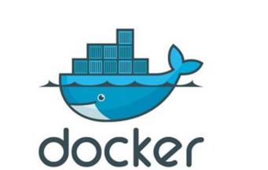

## 1.~~初识 Docker~~

> 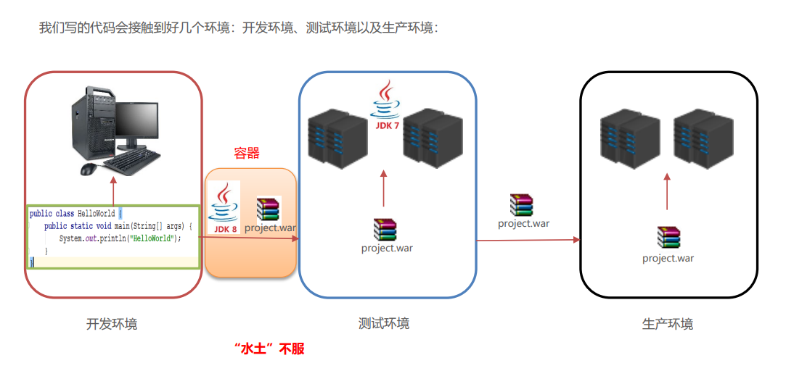

### ~~1.1Docker 概念~~

> • Docker 是一个开源的应用容器引擎 
>
> • 诞生于 2013 年初，基于 Go 语言实现， dotCloud 公司出品（后改名为Docker Inc）
>
>  • Docker 可以让开发者打包他们的应用以及依赖包到一个轻量级、可移植的容器中，然后发布到任何流行的 Linux 机器上。 
>
> •  容器是完全使用沙箱机制，相互隔离 
>
> • 容器性能开销极低。
>
>  • Docker 从 17.03 版本之后分为 CE（Community Edition: 社区版） 和 EE（Enterprise Edition: 企业版

### 1.2安装 Docker

Docker可以运行在MAC、Windows、CentOS、UBUNTU等操作系统上。官网：https://www.docker.com

### 1.3Docker 架构

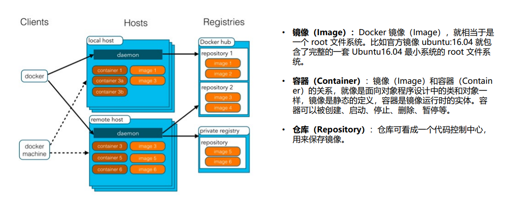

### 1.4配置 Docker 镜像加速器

默认情况下，将来从docker hub（https://hub.docker.com/）上下载 docker镜像，太慢。一般都会配置镜像加速器：

 • USTC：中科大镜像加速器（https://docker.mirrors.ustc.edu.cn） 

• 阿里云 

• 网易云 

• 腾讯云

## 2. <u>Docker命令</u>

> - 进程相关命令 
>
> -  镜像相关命令 
>
> - 容器相关命令

### 2.1 Docker 进程相关命令

- **启动docker服务**

​	`systemctl start docker`

- **停止docker服务**

​	`systemctl stop docker`

- **重启docker服务**

​	`systemctl restart docker`

- **查看docker服务状态**

​	`systemctl status docker`

- **开机启动docker服务**

​	`systemctl enable docker`


### 2.2 Docker 镜像相关命令

- **查看镜像:** 查看本地所有的镜像

   `docker images`

  `docker images docker images –q # 查看所用镜像的id` 

- **搜索镜像:**从网络中查找需要的镜像 

  `docker search 镜像名称`

- **拉取镜像**:从Docker仓库下载镜像到本地，镜像名称格式为 名称:版本号，如果版本号不指定则是最新的版本。 如果不知道镜像版本，可以去docker hub 搜索对应镜像查看。 

  `docker pull 镜像名称`

- **删除镜像**: 删除本地镜像

   `docker rmi 镜像id # 删除指定本地镜像 `

  `docker rmi docker images -q # 删除所有本地镜像`

### 2.3 Docker 容器相关命令

> • 查看容器 • 创建容器 • 进入容器 • 启动容器 • 停止容器 • 删除容器 • 查看容器信息

- **查看容器** 

  `docker ps # 查看正在运行的容器 `

  `docker ps –a # 查看所有容器`

  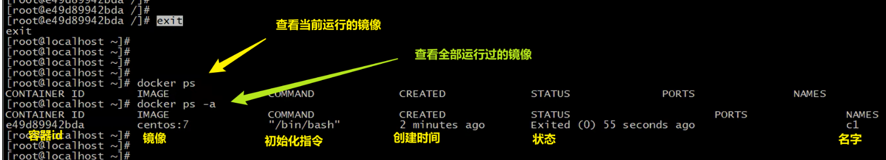

- **创建并启动容器**

  `docker run 参数` 

  > 参数说明：
  >
  > • -i：保持容器运行。通常与 -t 同时使用。加入it这两个参数后，容器创建后自动进入容器中，退出容器后，容器自动关闭。 
  >
  > • -t：为容器重新分配一个伪输入终端，通常与 -i 同时使用。
  >
  > • -d：以守护（后台）模式运行容器。创建一个容器在后台运行，需要使用docker exec 进入容器。退出后，容器不会关闭。
  >
  > • -it 创建的容器一般称为交互式容器，-id 创建的容器一般称为守护式容器
  >
  > • --name：为创建的容器命名。
  >
  > 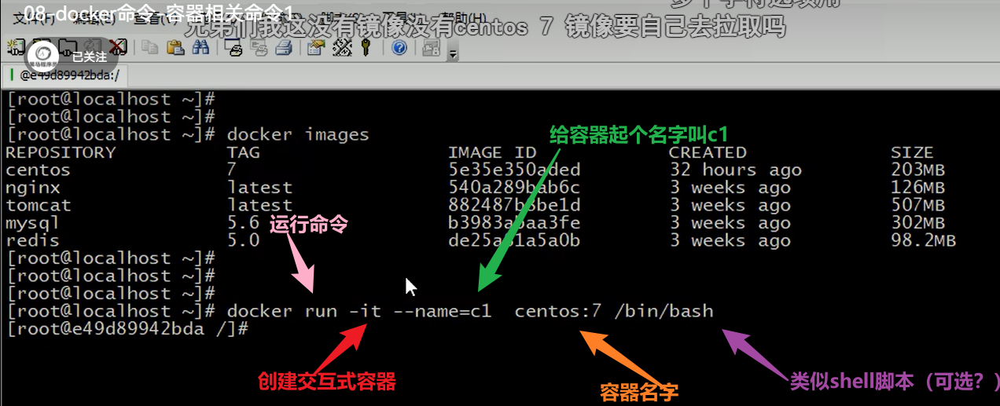
  >
  > 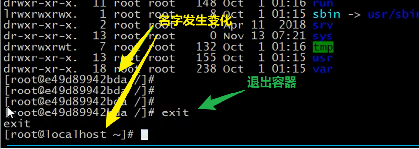

- **进入容器**

   `docker exec 参数 # 退出容器，容器不会关闭`

   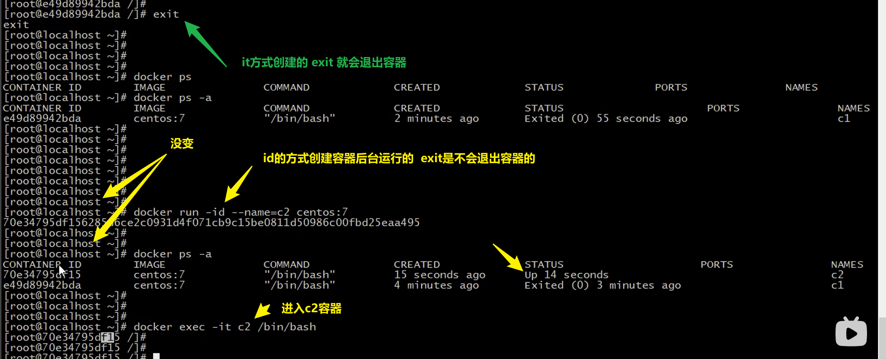

- **停止容器** 

  `docker stop 容器名称` 

- **启动容器** 

  `docker start 容器名称` 

- **删除容器：**如果容器是运行状态则删除失败，需要停止容器才能删除

   `docker rm 容器名称` 

   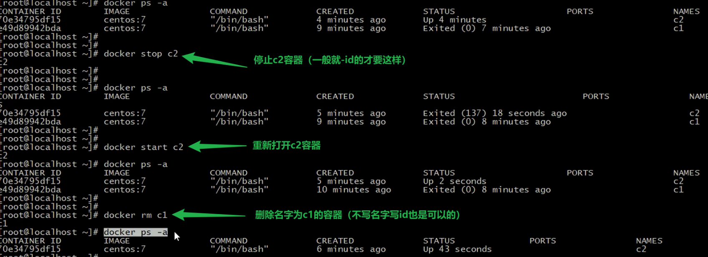

   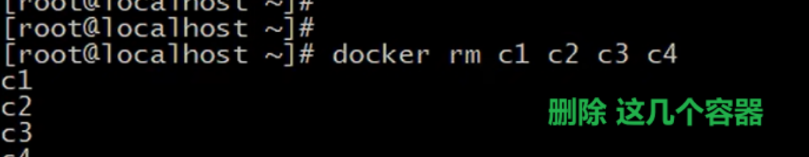

- **查看容器信息**

   `docker inspect 容器名称`

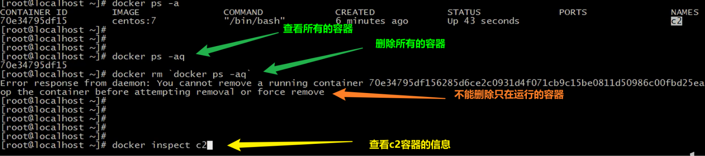


## 3. Docker 容器的数据卷

> - 数据卷概念及作用  
>
> - 配置数据卷 
>
> - 配置数据卷容器

### 3.1数据卷概念

**思考：** 

- Docker 容器删除后，在容器中产生的数据还在吗？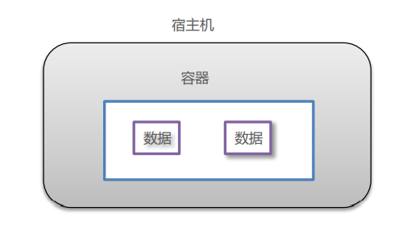

- Docker 容器和外部机器可以直接交换文件吗？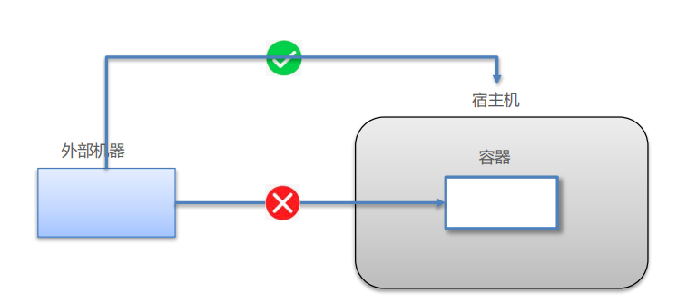

- 容器之间想要进行数据交互？                                               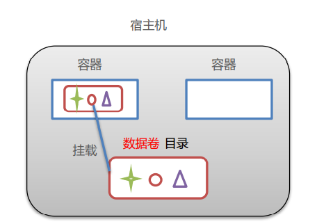

**数据卷** 

• 数据卷是宿主机中的一个目录或文件 

• 当容器目录和数据卷目录绑定后，对方的修改会立即同步 

• 一个数据卷可以被多个容器同时挂载 

• 一个容器也可以被挂载多个数据卷

​																				 				 				 **数据卷作用** 

​																				 				 				 • 容器数据持久化 

​																				 				 				 • 外部机器和容器间接通信

​																				 				 				 • 容器之间数据交换

### 3.2配置数据卷

- 创建启动容器时，使用 –v 参数 设置数据卷 

  `docker run ... –v 宿主机目录(文件):容器内目录(文件) ...`  

  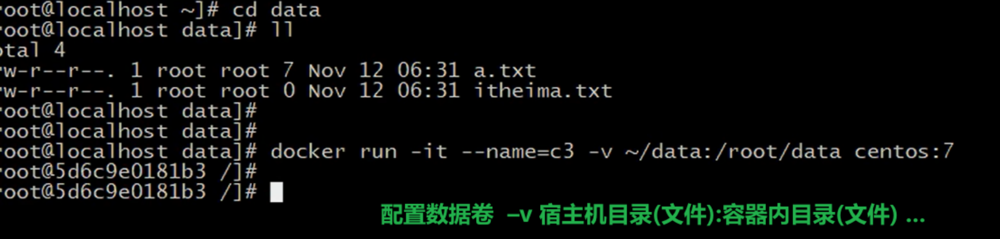

- 注意事项： 
  1. 目录必须是绝对路径 
  2. 如果目录不存在，会自动创建 
  3. 可以挂载多个数据卷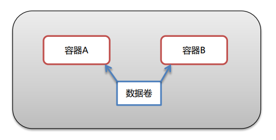

### 3.3 数据卷容器

多容器进行数据交换 

1. 多个容器挂载同一个数据卷 
2. 数据卷容器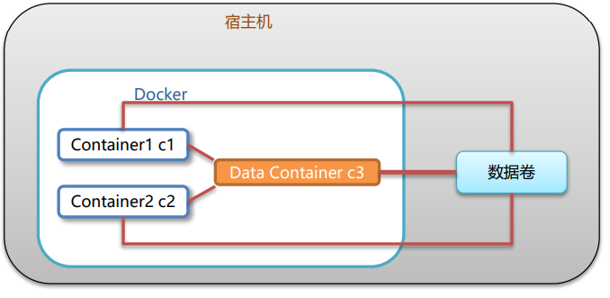

#### 3.3.1配置数据卷容器

1. 创建启动c3数据卷容器，使用 –v 参数 设置数据卷 （volume这个是自己起的但是一般就用这个名字）

    `	docker run –it --name=c3 –v /volume centos:7 /bin/bash`  

2. 创建启动 c1 c2 容器，使用 –-volumes-from 参数 设置数据卷

   `docker run –it --name=c1 --volumes-from c3 centos:7 /bin/bash` 

   `docker run –it --name=c2 --volumes-from c3 centos:7 /bin/bash` 

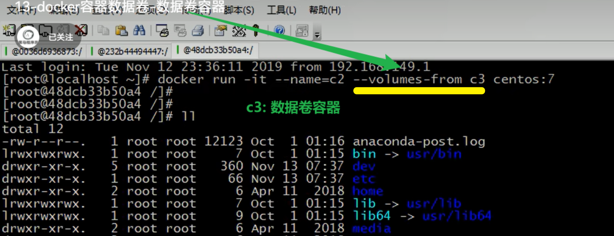

### 数据卷小结

1. 数据卷概念 

   - 宿主机的一个目录或文件 

2.  数据卷作用 

   - 容器数据持久化 

   - 客户端和容器数据交换 

   - 容器间数据交换 

3. 数据卷容器 

   - 创建一个容器，挂载一个目录，让其他容器继承自该容器( --volume-from )。

   - 通过简单方式实现数据卷配置


## 4. Docker 应用部署

> · MySQL部署 · Tomcat部署 · Nginx部署 · Redis部署

### MySQL部署

> **案例：需求**
>
> - 在Docker容器中部署MySQL，并通过外部mysql客户端操作MySQL Server。
>
>  **案例：实现步骤** 
>
> ​		① 搜索mysql镜像 
>
> ​		② 拉取mysql镜像
>
> ​		 ③ 创建容器
>
>  		④ 操作容器中的mysql
>
> > ---
> >
> > • 容器内的网络服务和外部机器不能直接通信 
> >
> > • 外部机器和宿主机可以直接通信
> >
> >  • 宿主机和容器可以直接通信
> >
> >  • 当容器中的网络服务需要被外部机器访问时，可以将容器中提供服务的端口映射到宿主机的端口上。外部机 器访问宿主机的该端口，从而间接访问容器的服务。 
> >
> > • 这种操作称为：**端口映射**
> >
> > 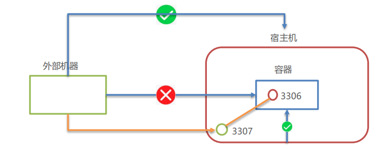

### Tomcat部署

> **案例：需求** 
>
> - 在Docker容器中部署Tomcat，并通过外部机器访问Tomcat部署的项目
>
> **案例：实现步骤**
>
>  		① 搜索tomcat镜像 
>
> ​		② 拉取tomcat镜像 
>
> ​		③ 创建容器 
>
> ​		④ 部署项目 
>
> ​		⑤ 测试访问

### Nginx部署

> **案例：需求**
>
> - 在Docker容器中部署Nginx，并通过外部机器访问Nginx
>
> **案例：实现步骤**
>
>  		① 搜索Nginx镜像 
> 	 	 	 	 	 	
>  		② 拉取Nginx镜像 
>
> ​		 ③ 创建容器
>
>  		④ 测试访问

### Redis部署

>  **案例：需求**
>
> - 在Docker容器中部署Redis，并通过外部机器访问Redis
>
> **案例：实现步骤** 
>
> ① 搜索Redis镜像
>
>  ② 拉取Redis镜像
>
>  ③ 创建容器
>
>  ④ 测试访问


## 5. Dockerfile

> --- Docker 镜像原理 --- Dockerfile概念及作用 --- Dockerfile关键字 --- 案例

### 5.1 Docker 镜像原理

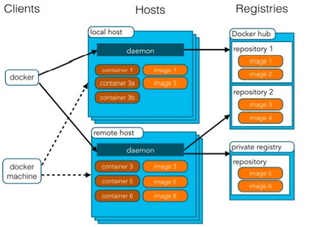

思考：

 • Docker 镜像本质是什么？

 • Docker 中一个centos镜像为什么只有200MB，而一个 centos操作系统的iso文件要几个个G？ 

 • Docker 中一个tomcat镜像为什么有500MB，而一个 tomcat安装包只有70多MB？

> 操作系统组成部分：
>
> • 进程调度子系统 
>
> • 进程通信子系统 
>
> • 内存管理子系统 
>
> • 设备管理子系统
>
>  • 文件管理子系统 
>
> • 网络通信子系统
>
>  • 作业控制子系统
>
> Linux文件系统由bootfs和rootfs两部分组成
>
>  • bootfs：包含bootloader（引导加载程序）和 kernel（内核）
>
>  • rootfs： root文件系统，包含的就是典型 Linux 系统中的/dev， /proc，/bin，/etc等标准目录和文件
>
>  • 不同的linux发行版，bootfs基本一样，而rootfs不同，如ubuntu ，centos等
>
> 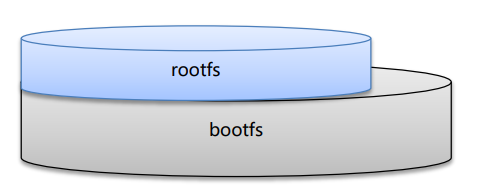
>
> > • Docker镜像是由特殊的文件系统叠加而成 
> >
> > • 最底端是 bootfs，并使用宿主机的bootfs 
> >
> > • 第二层是 root文件系统rootfs,称为base image 
> >
> > • 然后再往上可以叠加其他的镜像文件
> >
> >  • 统一文件系统（Union File System）技术能够将不同的 层整合成一个文件系统，为这些层提供了一个统一的视角 ，这样就隐藏了多层的存在，在用户的角度看来，只存在 一个文件系统。
> >
> >  • 一个镜像可以放在另一个镜像的上面。位于下面的镜像称 为父镜像，最底部的镜像成为基础镜像。 
> >
> > • 当从一个镜像启动容器时，Docker会在最顶层加载一个读 写文件系统作为容器
> >
> > > 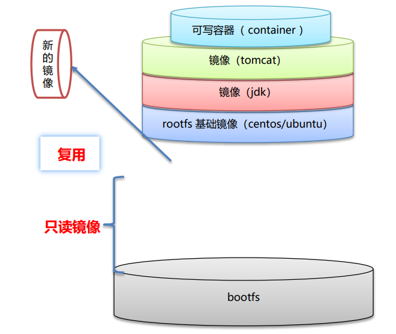
> > >
> > > > 思考：
> > > >
> > > > 1. Docker 镜像本质是什么？ 
> > > >
> > > >    • 是一个分层文件系统 
> > > >
> > > > 2. Docker 中一个centos镜像为什么只有200MB，而一个centos操作系统的iso文件要几个个G？
> > > >
> > > >     • Centos的iso镜像文件包含bootfs和rootfs，而docker的centos镜像复用操作系统的bootfs，只有rootfs和其他镜像层
> > > >
> > > > 3. Docker 中一个tomcat镜像为什么有500MB，而一个tomcat安装包只有70多MB？
> > > >
> > > >     • 由于docker中镜像是分层的，tomcat虽然只有70多MB，但他需要依赖于父镜像和基础镜像，所有整个对外暴露的 tomcat镜像大小500多MB


#### 5.1.1镜像制作

1. 容器转为镜像

   ```shell
   docker commit 容器id 镜像名称:版本号
   docker save -o 压缩文件名称 镜像名称:版本号
   docker load –i 压缩文件名称
   ```

   

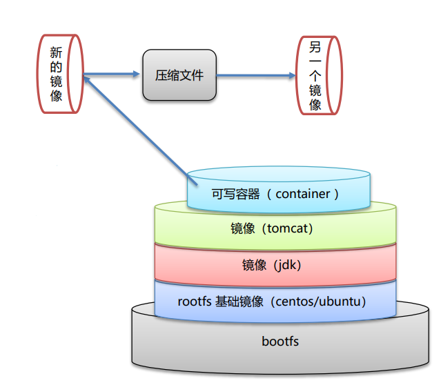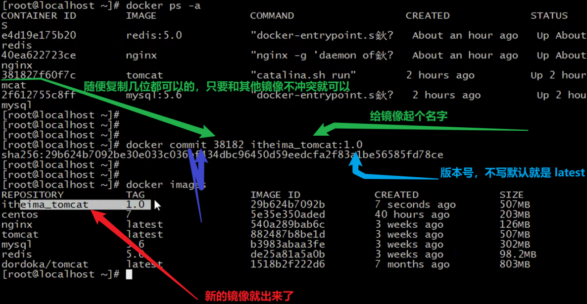

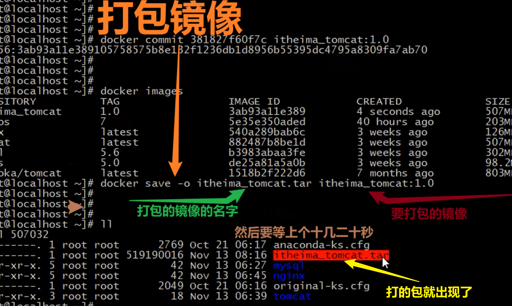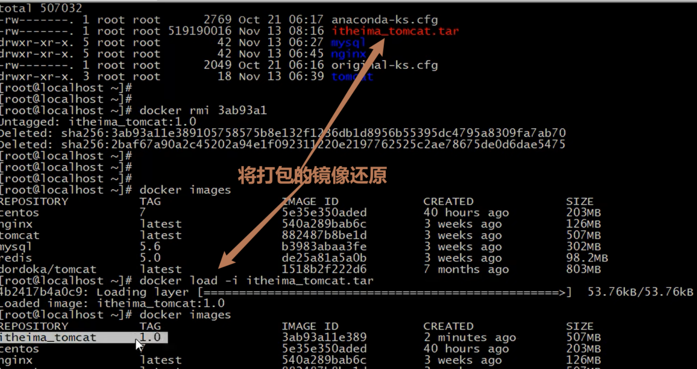


### 5.2 Dockerfile 概念


> • Dockerfile 是一个文本文件
>
> • 包含了一条条的指令 
>
> • 每一条指令构建一层，基于基础镜像，最终构建出一个新的镜像 
>
> • 对于开发人员：可以为开发团队提供一个完全一致的开发环境
>
> • 对于测试人员：可以直接拿开发时所构建的镜像或者通过Dockerfile文件 构建一个新的镜像开始工作了 
>
> • 对于运维人员：在部署时，可以实现应用的无缝移植
>
> ​											 Dochub网址：https://hub.docker.com
>
> 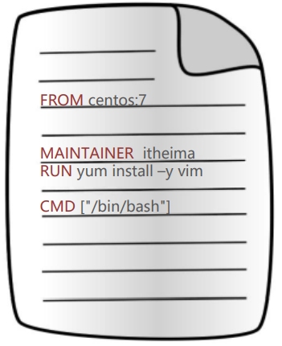

### 5.2.1 *Dockerfile 关键字

- **查看 文档目录中的《dockerfile.md》**


### 5.3 Dockerfile 案例

#### 自定义centos7镜像

> **案例：需求**
>
> - 自定义centos7镜像。要求： 
>
>   - 1.默认登录路径为 /usr 
>
>   - 2.可以使用vim
>
> 
>
> **案例：实现步骤**
>
> ​		 ① 定义父镜像：`FROM centos:7` 
>
> ​		 ② 定义作者信息：`MAINTAINER itheima <ikun@qq.org>`  
>
>  		③ 执行安装vim命令： `RUN yum install -y vim` 
>
> ​		 ④ 定义默认的工作目录：`WORKDIR /usr`
>
>  		⑤ 定义容器启动执行的命令：`CMD /bin/bash` 
>
> ​		 ⑥ 通过dockerfile构建镜像：`docker bulid –f dockerfile文件路径 –t 镜像名称:版本`

---

#### 发布springboot项目

> **案例：需求**
>
> - 定义dockerfile，发布springboot项目
>
> **案例：实现步骤**
>
>  	① 定义父镜像：`FROM java:8` 
> 	 	
>  	② 定义作者信息：`MAINTAINER itheima <ikun@qq.org>`
> 	 	
>  	③ 将jar包添加到容器： `ADD springboot.jar app.jar` 
> 	 	
>  	④ 定义容器启动执行的命令：`CMD java–jar app.jar`
> 	 	
>  	⑤ 通过dockerfile构建镜像：`docker bulid –f dockerfile文件路径 –t 镜像名称:版本`

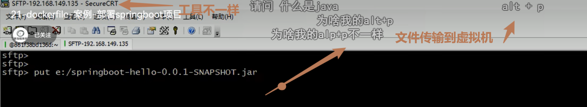

## 6. Docker 服务编排

> * 服务编排概念      * Docker Compose 概述      * 案例

### 6.1服务编排

> 微服务架构的应用系统中一般包含若干个微服务，每个微服务一般都会部署多个实例，如果每个微服务都要手动启停 ，维护的工作量会很大。 
>
> • 要从Dockerfile build image 或者去dockerhub拉取image 
>
> • 要创建多个container
>
>  • 要管理这些container（启动停止删除）
>
> ​                          **服务编排**： 按照一定的业务规则批量管理容器


#### 6.1.1Docker Compose

Docker Compose是一个编排多容器分布式部署的工具，提供命令集管理容器化应用的完整开发周期，包括服务构建 ，启动和停止。使用步骤： 

1. 利用 Dockerfile 定义运行环境镜像 
2.  使用 docker-compose.yml 定义组成应用的各服务
3. 运行 docker-compose up 启动应用

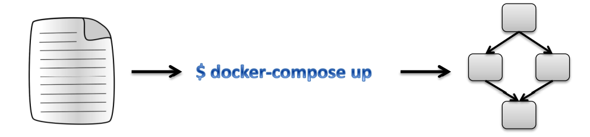

**Docker Compose 安装使用**

- 打开文档：**《docker-compose.md》**查看


## 7. Docker 私有仓库

> Docker官方的Docker hub（https://hub.docker.com）是一个用于管理公共镜像的仓库，我们可以从上面拉取镜像 到本地，也可以把我们自己的镜像推送上去。但是，有时候我们的服务器无法访问互联网，或者你不希望将自己的镜 像放到公网当中，那么我们就需要搭建自己的私有仓库来存储和管理自己的镜像。


## 8. Docker相关概念

### docker容器虚拟化 与 传统虚拟机比较

容器就是将软件打包成标准化单元，以用于开发、交付和部署。

 • 容器镜像是轻量的、可执行的独立软件包 ，包含软件运行所需的所有内容：代码、运行时环境、系统工具、 系统库和设置。

 • 容器化软件在任何环境中都能够始终如一地运行。 

• 容器赋予了软件独立性，使其免受外在环境差异的影响，从而有助于减少团队间在相同基础设施上运行不同软 件时的冲突。

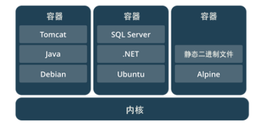

**docker容器虚拟化 与 传统虚拟机比较 **

**相同：**

 • 容器和虚拟机具有相似的资源隔离和分配优势

 **不同：** 

• 容器虚拟化的是操作系统，虚拟机虚拟化的是硬件。 

• 传统虚拟机可以运行不同的操作系统，容器只能运行同一类型操作系统

​               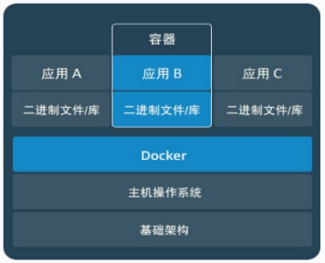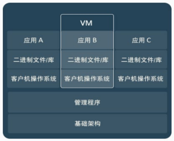

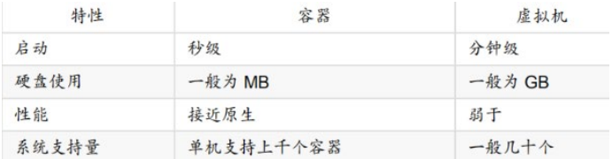
