> 弹幕：shift + insert就是粘贴
>

# Git分布式版本控制工具 

## ~~1、目标~~ 

- 了解Git基本概念

- 能够概述git工作流程

- 能够使用Git常用命令

- 熟悉Git代码托管服务

- 能够使用idea操作git

  

## 2、概述 

  ### ~~2.1、开发中的实际场景~~ 

> 场景一：备份
>     小明负责的模块就要完成了，就在即将Release之前的一瞬间，电脑突然蓝屏，硬盘光荣牺牲！几个月来的努力付之东流
> 
>场景二：代码还原
>      这个项目中需要一个很复杂的功能，老王摸索了一个星期终于有眉目了，可是这被改得面目全非的代码已经回不到从前了。什么地方能买到哆啦A梦的时光机啊？
>    
> 场景三：协同开发
>     小刚和小强先后从文件服务器上下载了同一个文件：Analysis.java。小刚在Analysis.java文件中的第30行声明了一个方法，叫count()，先保存到了文件服务器上；小强在Analysis.java文件中的第50行声明了一个方法，叫sum()，也随后保存到了文件服务器上，于是，count()方法就只存在于小刚的记忆中了
> 
>    场景四：追溯问题代码的编写人和编写时间！
>      老王是另一位项目经理，每次因为项目进度挨骂之后，他都不知道该扣哪个程序员的工资！就拿这次来说吧，有个Bug调试了30多个小时才知道是因为相关属性没有在应用初始化时赋值！可是二胖、王东、刘流和正经牛都不承认是自己干的！


### ~~2.2、版本控制器的方式~~ 

> a、集中式版本控制工具
>     集中式版本控制工具，版本库是集中存放在中央服务器的，team里每个人work时从中央服务器下载代码，是必须联网才能工作，局域网或互联网。个人修改后然后提交到中央版本库。
>     举例：SVN和CVS
> b、分布式版本控制工具
>     分布式版本控制系统没有“中央服务器”，每个人的电脑上都是一个完整的版本库，这样工作的时候，无需要联网了，因为版本库就在你自己的电脑上。多人协作只需要各自的修改推送给对方，就能互相看到对方的修改了。
>     举例：Git

### ~~2.3、SVN~~


### 2.4、Git 

> Git是分布式的,Git不需要有中心服务器，我们每台电脑拥有的东西都是一样的。我们使用Git并且有个中心服务器，仅仅是为了方便交换大家的修改，但是这个服务器的地位和我们每个人的PC是一样的。我们可以把它当做一个开发者的pc就可以就是为了大家代码容易交流不关机用的。没有它大家一样可以工作，只不过“交换”修改不方便而已。
>   git是一个开源的分布式版本控制系统，可以有效、高速地处理从很小到非常大的项目版本管理。Git是Linus Torvalds 为了帮助管理 Linux 内核开发而开发的一个开放源码的版本控制软件。同生活中的许多伟大事物一样，Git 诞生于一个极富纷争大举创新的年代。Linux 内核开源项目有着为数众多的参与者。 绝大多数的 Linux 内核维护工作都花在了提交补丁和保存归档的繁琐事务上（1991－2002年间）。 到 2002 年，整个项目组开始启用一个专有的分布式版本控制系统 BitKeeper 来管理和维护代码。
> 	到了 2005 年，开发 BitKeeper 的商业公司同 Linux 内核开源社区的合作关系结束，他们收回了 Linux 内核社区免费使用 BitKeeper 的权力。 这就迫使 Linux 开源社区（特别是 Linux 的缔造者 Linus Torvalds）基于使用 BitKeeper 时的经验教训，开发出自己的版本系统。 他们对新的系统制订了若干目标：
>
> - 速度
>
> - 简单的设计
>
> - 对非线性开发模式的强力支持（允许成千上万个并行开发的分支）
>
> - 完全分布式
>
> - 有能力高效管理类似 Linux 内核一样的超大规模项目（速度和数据量）

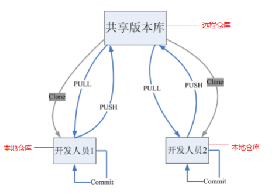

### 2.5、Git工作流程图*

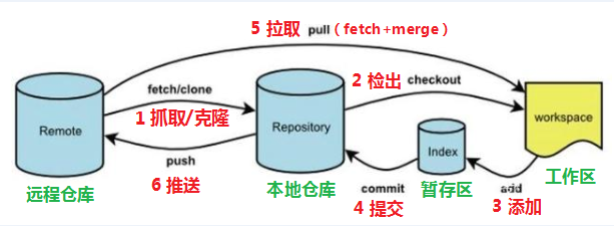

命令如下：

1. clone（克隆）: 从远程仓库中克隆代码到本地仓库
2. checkout （检出）:从本地仓库中检出一个仓库分支然后进行修订
3. add（添加）: 在提交前先将代码提交到暂存区
4. commit（提交）: 提交到本地仓库。本地仓库中保存修改的各个历史版本
5. fetch (抓取) ： 从远程库，抓取到本地仓库，不进行任何的合并动作，一般操作比较少。
6. pull (拉取) ： 从远程库拉到本地库，自动进行合并(merge)，然后放到到工作区，相当于fetch+merge
7. push（推送） : 修改完成后，需要和团队成员共享代码时，将代码推送到远程仓库


## 3、Git安装与常用命令*

本教程里的git命令例子都是在Git Bash中演示的，会用到一些基本的linux命令，在此为大家提前列举：

- ls/ll 查看当前目录*

- cat 查看文件内容

- touch 创建文件

- vi vi编辑器（使用vi编辑器是为了方便展示效果，也可以记事本等其它编辑器）

> ll是自己配置的在`‪C:\Users\Administrator\.bashrc`文件中写入 `alias ll='ls -al'`
>
> 注意：（Administrator为用户文件夹每个用户文件夹名字都可能不一样）


### 3.1、 Git环境配置

#### 3.1.1 下载与安装 

下载地址： https://git-scm.com/download

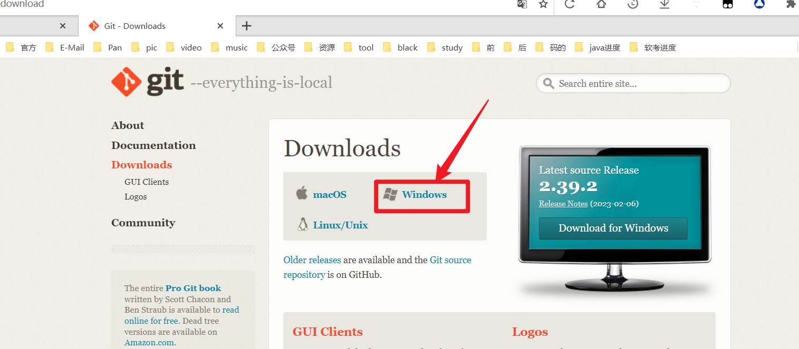

下载完成后双击下载的安装文件来安装Git。安装完成后在电脑桌面（也可以是其他目录）点击右键，如果能够看
到如下两个菜单则说明Git安装成功。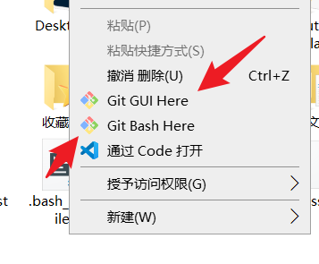

备注：
-  Git GUI：Git提供的图形界面工具
-  Git Bash：Git提供的命令行工具

当安装Git后首先要做的事情是设置`用户名称`和`email地址`。这是非常重要的，因为每次Git提交都会使用该用户信息


#### 3.1.2基本配置 

1. 打开Git Bash

2. 设置用户信息

  ```shell
  git config --global user.name “yc556”
  git config --global user.email “hello@cgl.org”
  ```
 3. 查看配置信息

  ```shell
  git config --global user.name
  git config --global user.email
  ```

> 也可以在`C:\Users\Administrator\.gitconfig`中查看或修改	
>
> 注意：（Administrator为用户文件夹每个用户文件夹名字都可能不一样）


#### 3.1.3 为常用指令配置别名（可选） *

有些常用的指令参数非常多，每次都要输入好多参数，我们可以使用别名。

1. 打开用户目录，创建.bashrc文件
部分windows系统不允许用户创建点号开头的文件，可以打开gitBash,执行 touch ~/.bashrc

2. 在.bashrc文件中输入如下内容：

```shell
#用于输出git提交日志
alias git-log='git log --pretty=oneline --all --graph --abbrev-commit'
#用于输出当前目录所有文件及基本信息
alias ll='ls -al'
```

3. 打开gitBash，执行`source ~/.bashrc`

   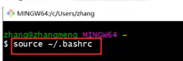

> ~/这表示当前用户的主目录


#### 3.1.4 解决GitBash乱码问题 

1. 打开GitBash执行下面命令

   ```shell
   git config --global core.quotepath false
   ```

2. ${git_home}/etc/bash.bashrc 文件最后加入下面两行

   ```shell
   export LANG="zh_CN.UTF-8"
   export LC_ALL="zh_CN.UTF-8"
   ```

   > ${git_home}的意思是去Git的安装目录下


### 3.2、获取本地仓库 

要使用Git对我们的代码进行版本控制，首先需要获得本地仓库
1）在电脑的任意位置创建一个空目录（例如test）作为我们的本地Git仓库
2）进入这个目录中，点击右键打开Git bash窗口
3）执行命令git init
4）如果创建成功后可在文件夹下看到隐藏的.git目录。

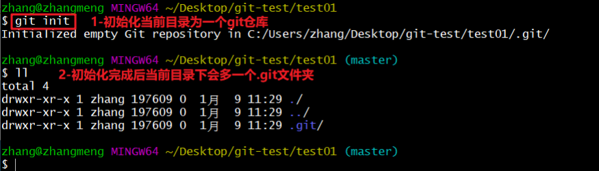

​		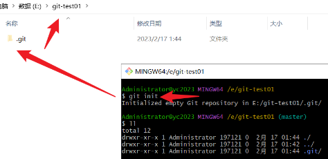

### 3.3、基础操作指令 

Git工作目录下对于文件的修改(增加、删除、更新)会存在几个状态，这些修改的状态会随着我们执行Git
的命令而发生变化。

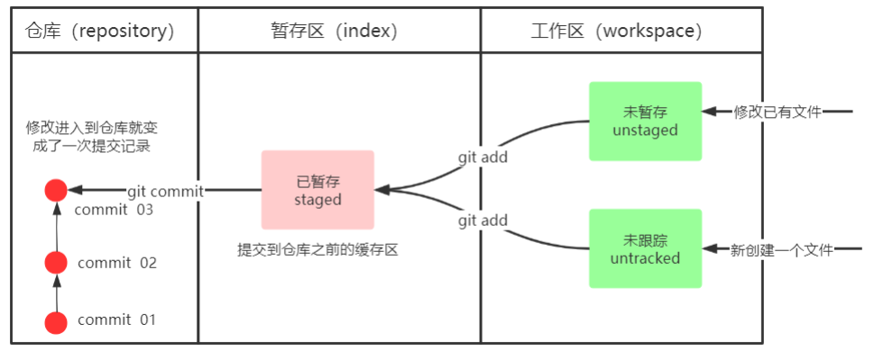

本章节主要讲解如何使用命令来控制这些状态之间的转换：
	1. git add (工作区 --> 暂存区)
	2. git commit (暂存区 --> 本地仓库)

#### 3.3.1、*查看修改的状态（status） 

作用：查看的修改的状态（暂存区、工作区）
命令形式：git status

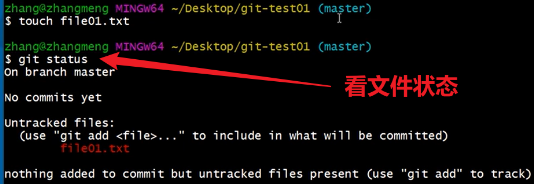

#### 3.3.2、*添加工作区到暂存区(add) 

作用：添加工作区一个或多个文件的修改到暂存区
命令形式：git add 单个文件名|通配符
将所有修改加入暂存区：git add .

#### 3.3.3、*提交暂存区到本地仓库(commit) 

作用：提交暂存区内容到本地仓库的当前分支
命令形式：git commit -m '注释内容'

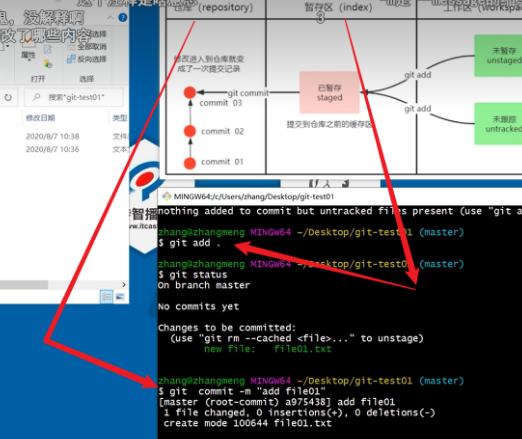

#### 3.3.4、*查看提交日志(log) 

**在3.1.3中配置的别名git-log就包含了这些参数，所以后续可以直接使用指令git-log**

- 作用:查看提交记录

- 命令形式：git log [option]

  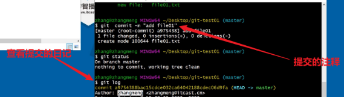

  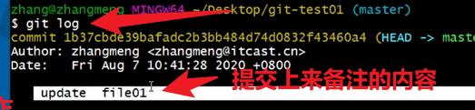

  - options

    - --all 显示所有分支

    - --pretty=oneline 将提交信息显示为一行

    - --abbrev-commit 使得输出的commitId更简短

    - --graph 以图的形式显示


#### 3.3.5、版本回退 

- 作用：版本切换

- 命令形式：git reset --hard commitID
  - commitID 可以使用git-log或git log指令查看

- 如何查看已经删除的记录？

  - git reflog

  - 这个指令可以看到已经删除的提交记录（比如我在5版本退回3版本git-log就看不到后面的版本了）


#### 3.3.6、添加文件至忽略列表 

一般我们总会有些文件无需纳入Git 的管理，也不希望它们总出现在未跟踪文件列表。 通常都是些自动
生成的文件，比如日志文件，或者编译过程中创建的临时文件等。 在这种情况下，我们可以在工作目录
中创建一个名为 .gitignore 的文件（文件名称固定），列出要忽略的文件模式。下面是一个示例：

```shell
# no .a files
*.a
# but do track lib.a, even though you're ignoring .a files above
!lib.a
# only ignore the TODO file in the current directory, not subdir/TODO
/TODO
# ignore all files in the build/ directory
build/
# ignore doc/notes.txt, but not doc/server/arch.txt
doc/*.txt
# ignore all .pdf files in the doc/ directory
doc/**/*.pdf
```


---

```
提交.gitignore文件并使其中的规则生效：
有时候在 .gitignore 文件中添加规则并未生效，原因是 .gitignore 只能忽略原来没有被 track 的文件，如果某些文件已经加入了版本管理中，修改 .gitignore 是无效的。解决方法：先把不想记录文件的本地缓存删除，再在 .gitignore 中添加忽略该文件，然后再提交。


#清除本地缓存(改变成未track状态)

git rm -r -f --cached . 表示清除项目中所有文件的本地缓存

git add . #添加除了忽略文件外的所有文件

然后提交推送

#.gitignore 可以使用绝对路径，也可以只写一个文件名或者文件夹
```


#### 练习:基础操作

```shell
#####################仓库初始化######################
# 创建目录（git_test01）并在目录下打开gitbash
略
# 初始化git仓库
git init

#####################创建文件并提交#####################
# 目录下创建文件 file01.txt
略
# 将修改加入暂存区
git add .
# 将修改提交到本地仓库，提交记录内容为：commit 001
git commit -m 'commit 001'
# 查看日志
git log

####################修改文件并提交######################
# 修改file01的内容为：count=1
略
# 将修改加入暂存区
git add .
# # 将修改提交到本地仓库，提交记录内容为：update file01
git commit --m 'update file01'
# 查看日志
git log
# 以精简的方式显示提交记录
git-log
####################将最后一次修改还原##################
# 查看提交记录
git-log
# 找到倒数第2次提交的commitID
略
# 版本回退
git reset commitID --hard
```


### 3.4、分支 

几乎所有的版本控制系统都以某种形式支持分支。 使用分支意味着你可以把你的工作从开发主线上分离
开来进行重大的Bug修改、开发新的功能，以免影响开发主线。

#### 3.4.1、查看本地分支 

- 命令：`git branch`

#### 3.4.2、创建本地分支 

- 命令：`git branch 分支名`

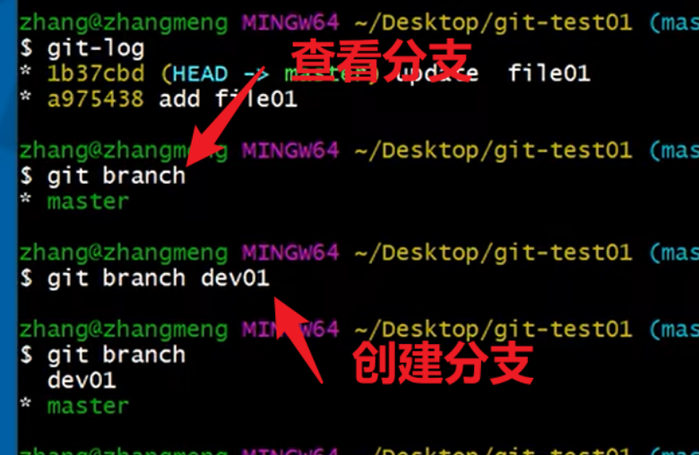

#### 3.4.4、*切换分支(checkout) 

- 命令：`git checkout 分支名`

  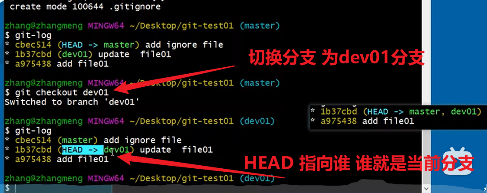

我们还可以直接切换到一个不存在的分支（创建并切换）

- 命令：`git checkout -b 分支名`

  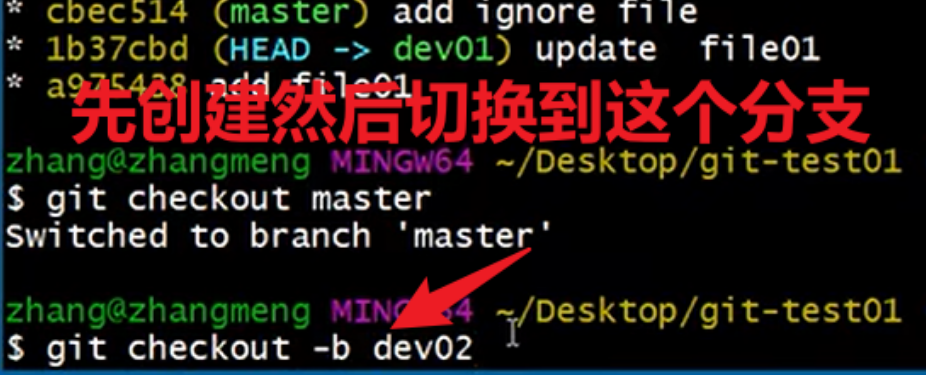

#### 3.4.6、*合并分支(merge) 

一个分支上的提交可以合并到另一个分支

- 命令：`git merge 分支名称`

#### 3.4.7、删除分支 

**不能删除当前分支，只能删除其他分支**
`git branch -d 分支名` 删除分支时，需要做各种检查
`git branch -D 分支名` 不做任何检查，强制删除

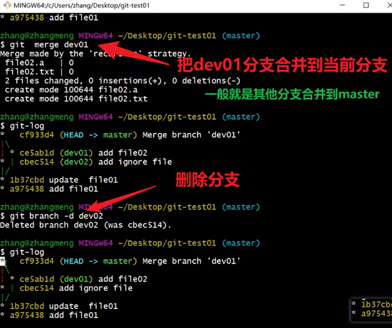

#### 3.4.8、解决冲突 

当两个分支上对文件的修改可能会存在冲突，例如同时修改了同一个文件的同一行，这时就需要手动解
决冲突，解决冲突步骤如下：

1. 处理文件中冲突的地方

2. 将解决完冲突的文件加入暂存区(add)

3. 提交到仓库(commit)


冲突部分的内容处理如下所示：

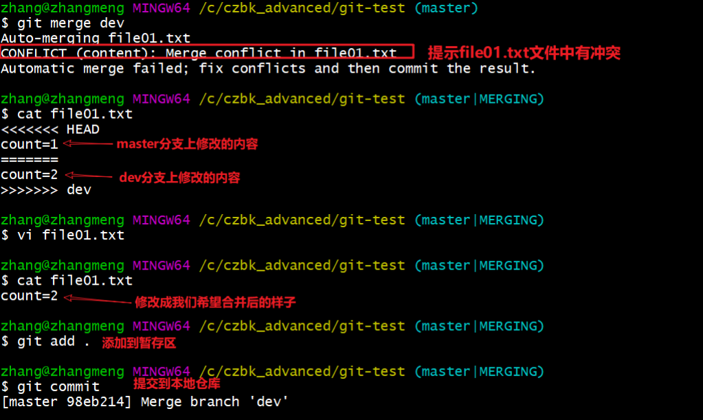

#### 3.4.9、开发中分支使用原则与流程 

几乎所有的版本控制系统都以某种形式支持分支。 使用分支意味着你可以把你的工作从开发主线上分离
开来进行重大的Bug修改、开发新的功能，以免影响开发主线。

在开发中，一般有如下分支使用原则与流程：

- master （生产） 分支线上分支，主分支，中小规模项目作为线上运行的应用对应的分支；

- develop（开发）分支
  是从master创建的分支，一般作为开发部门的主要开发分支，如果没有其他并行开发不同期上线
  要求，都可以在此版本进行开发，阶段开发完成后，需要是合并到master分支,准备上线。

- feature/xxxx分支
  从develop创建的分支，一般是同期并行开发，但不同期上线时创建的分支，分支上的研发任务完
  成后合并到develop分支。

- hotfix/xxxx分支，
  从master派生的分支，一般作为线上bug修复使用，修复完成后需要合并到master、test、

- develop分支。
  还有一些其他分支，在此不再详述，例如test分支（用于代码测试）、pre分支（预上线分支）等
  等。

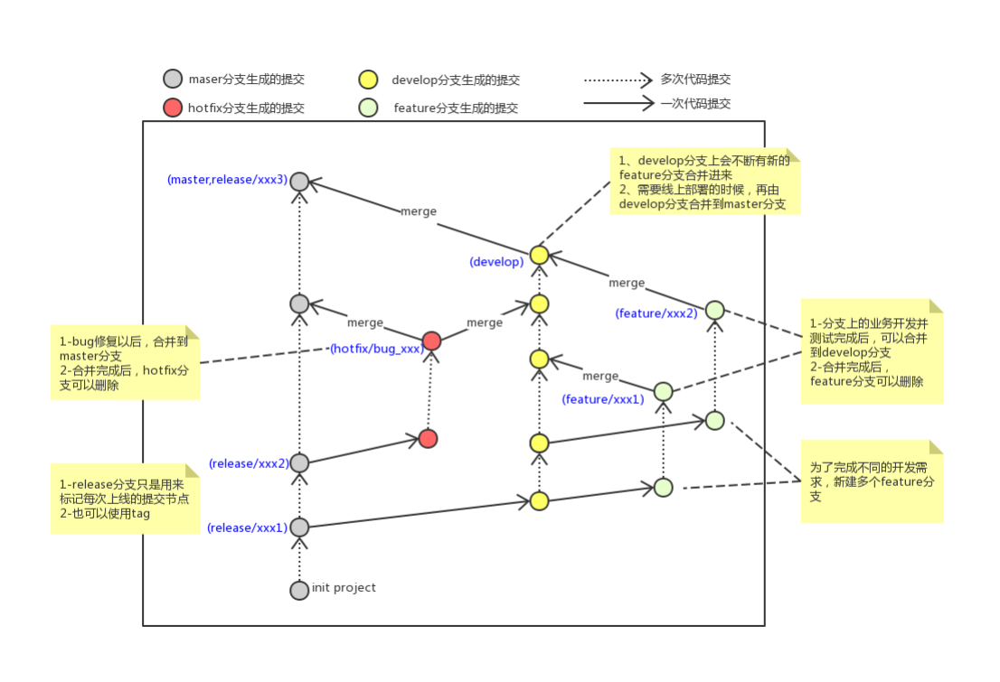

#### 练习:分支操作

```shell
###########################创建并切换到dev01分支，在dev01分支提交
# [master]创建分支dev01
git branch dev01
# [master]切换到dev01
git checkout dev01
# [dev01]创建文件file02.txt
略
# [dev01]将修改加入暂存区并提交到仓库,提交记录内容为：add file02 on dev
git add .
git commit -m 'add file02 on dev'
# [dev01]以精简的方式显示提交记录
git-log
###########################切换到master分支，将dev01合并到master分支
# [dev01]切换到master分支
git checkout master
# [master]合并dev01到master分支
git merge dev01
# [master]以精简的方式显示提交记录
git-log
# [master]查看文件变化(目录下也出现了file02.txt)
略
##########################删除dev01分支
# [master]删除dev01分支
git branch -d dev01
# [master]以精简的方式显示提交记录
git-log
```


## 4、Git远程仓库 

### 4.1、 常用的托管服务[远程仓库] 

> 前面我们已经知道了Git中存在两种类型的仓库，即本地仓库和远程仓库。那么我们如何搭建Git远程仓库呢？我们可以借助互联网上提供的一些代码托管服务来实现，其中比较常用的有GitHub、码云、GitLab等。
>
> - gitHub（ 地址：https://github.com/ ）是一个面向开源及私有软件项目的托管平台，因为只支持Git 作为唯一的版本库格式进行托管，故名gitHub
>
> - 码云（地址： https://gitee.com/ ）是国内的一个代码托管平台，由于服务器在国内，所以相比于
>   GitHub，码云速度会更快
>
> - GitLab （地址： https://about.gitlab.com/ ）是一个用于仓库管理系统的开源项目，使用Git作
>   为代码管理工具，并在此基础上搭建起来的web服务,一般用于在企业、学校等内部网络搭建git私服。


### 4.2、 注册码云

要想使用码云的相关服务，需要注册账号（地址： https://gitee.com/signup ）

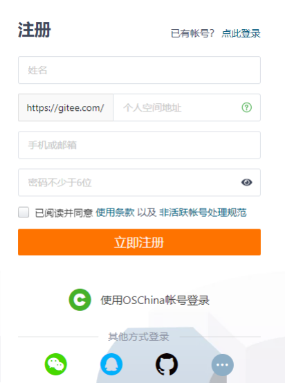

### 4.3、 创建远程仓库

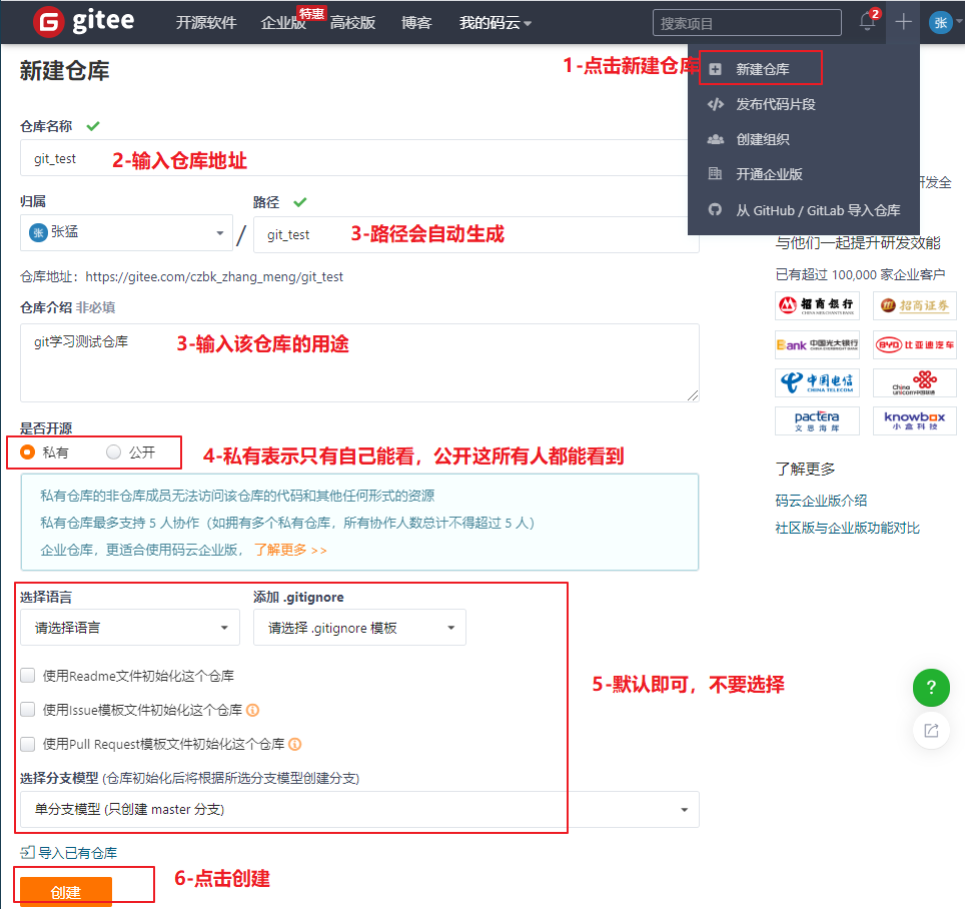


**仓库创建完成后可以看到仓库地址，如下图所示:**

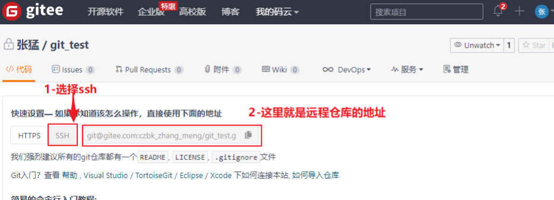

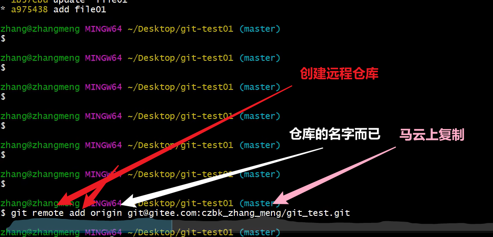

### 4.4、配置SSH公钥 

- 生成SSH公钥

  - `ssh-keygen -t rsa`

  - 不断回车
    - 如果公钥已经存在，则自动覆盖

- Gitee设置账户共公钥
  - 获取公钥
    - `cat ~/.ssh/id_rsa.pub`

	    
	  
	- 
	
	- 验证是否配置成功
	
	  - `ssh -T git@gitee.com`

​	

### 4.5、操作远程仓库 

#### 4.5.1、添加远程仓库 

**此操作是先初始化本地库，然后与已创建的远程库进行对接。**
命令： `git remote add <远端名称> <仓库路径>`
远端名称，默认是origin，取决于远端服务器设置
仓库路径，从远端服务器获取此URL
例如: `git remote add origin git@gitee.com:czbk_zhang_meng/git_test.git`


#### 4.5.2、查看远程仓库 

命令：`git remote`

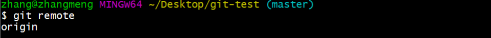


#### 4.5.3、推送到远程仓库 

- 命令：`git push [-f] [--set-upstream] [远端名称 [本地分支名][:远端分支名] ]`

  - 如果远程分支名和本地分支名称相同，则可以只写本地分支 
    - `git push origin master`
  - `-f` 表示强制覆盖
  - `--set-upstream` 推送到远端的同时并且建立起和远端分支的关联关系。
    - `git push --set-upstream origin master`
  - 如果当前分支已经和远端分支关联，则可以省略分支名和远端名。
    - `git push` 将master分支推送到已关联的远端分支。

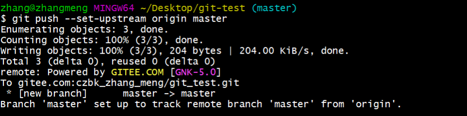

##### 4.5.3.1移除远程仓库

`# 移除远程仓库和本地仓库的关系(只是从本地移除远程仓库的关联关系，并不会真正影响到远程仓库)`
`git remote rm <shortname>`


##### 查询远程仓库


#### 4.5.4、 本地分支与远程分支的关联关系 

- 查看关联关系我们可以使用 `git branch -vv`命令

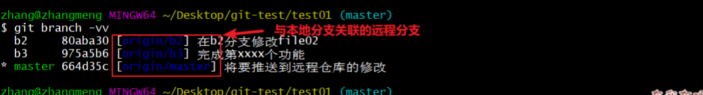

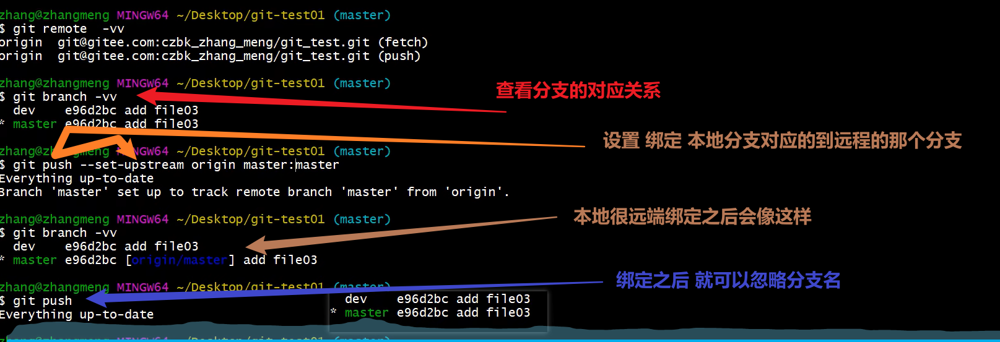

#### 4.5.5、从远程仓库克隆 

如果已经有一个远端仓库，我们可以直接clone到本地。

- 命令: `git clone <仓库路径> [本地目录]`
  - 本地目录可以省略，会自动生成一个目录

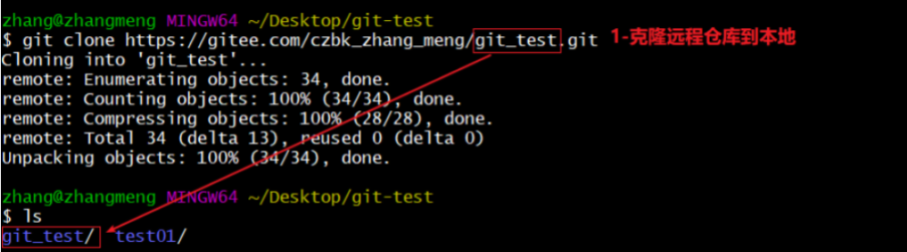


#### 4.5.6、从远程仓库中抓取和拉取 

远程分支和本地的分支一样，我们可以进行merge操作，只是需要先把远端仓库里的更新都下载到本地，再进行操作。

- 抓取 命令：`git fetch [remote name] [branch name]`
  - 抓取指令就是将仓库里的更新都抓取到本地，不会进行合并
  - 如果不指定远端名称和分支名，则抓取所有分支。
- 拉取 命令：`git pull [remote name] [branch name]`
  - 拉取指令就是将远端仓库的修改拉到本地并自动进行合并，等同于fetch+merge
  - 如果不指定远端名称和分支名，则抓取所有并更新当前分支。

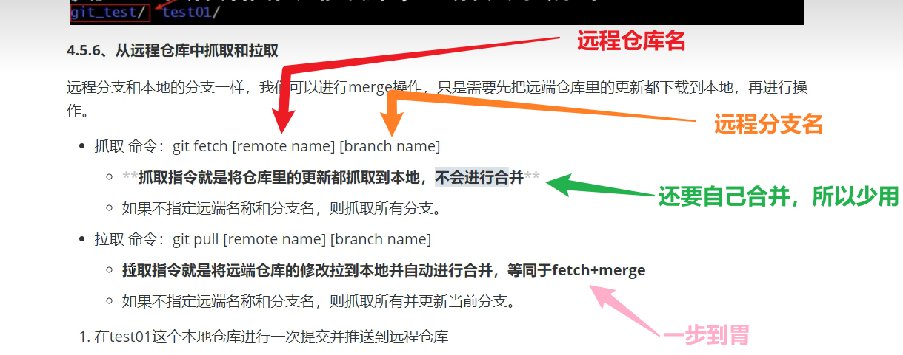

1. 在test01这个本地仓库进行一次提交并推送到远程仓库

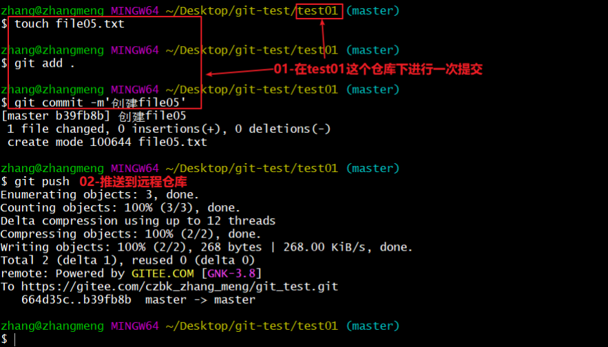


2. 在另一个仓库将远程提交的代码拉取到本地仓库

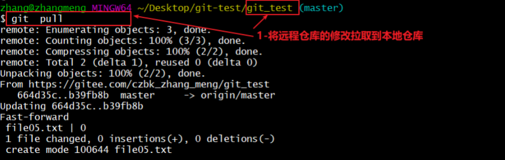


#### 4.5.7、解决合并冲突 

在一段时间，A、B用户修改了同一个文件，且修改了同一行位置的代码，此时会发生合并冲突。
A用户在本地修改代码后优先推送到远程仓库，此时B用户在本地修订代码，提交到本地仓库后，也需要推送到远程仓库，此时B用户晚于A用户，故需要先拉取远程仓库的提交，经过合并后才能推送到远端分支,如下图所示。

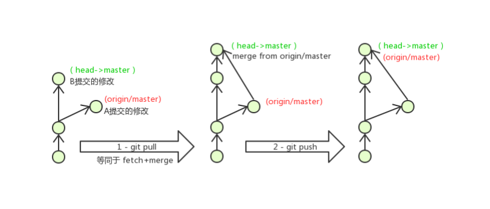

在B用户拉取代码时，因为A、B用户同一段时间修改了同一个文件的相同位置代码，故会发生合并冲
突。
**远程分支也是分支，所以合并时冲突的解决方式也和解决本地分支冲突相同相同。**


#### 练习:远程仓库操作 

```shell
##########################1-将本地仓库推送到远程仓库
# 完成4.1、4.2、4.3、4.4的操作
略
# [git_test01]添加远程仓库
git remote add origin  git@gitee.com/**/**.git
# [git_test01]将master分支推送到远程仓库,并与远程仓库的master分支绑定关联关系
git push --set-upstream origin master

###########################2-将远程仓库克隆到本地
# 将远程仓库克隆到本地git_test02目录下
git clone git@gitee.com/**/**.git  git_test02
# [git_test02]以精简的方式显示提交记录
git-log

###########################3-将本地修改推送到远程仓库
# [git_test01]创建文件file03.txt
略
# [git_test01]将修改加入暂存区并提交到仓库,提交记录内容为：add file03
git add .
git commit -m 'add file03'
# [git_test01]将master分支的修改推送到远程仓库
git push origin master

###########################4-将远程仓库的修改更新到本地
# [git_test02]将远程仓库修改再拉取到本地
git pull
# 以精简的方式显示提交记录
git-log
# 查看文件变化(目录下也出现了file03.txt)
略
```


## 5、在Idea中使用Git 

### 5.1、在Idea中配置Git 

安装好IntelliJ IDEA后，如果Git安装在默认路径下，那么idea会自动找到git的位置，如果更改了Git的安
装位置则需要手动配置下Git的路径。选择File→Settings打开设置窗口，找到Version Control下的git选
项：

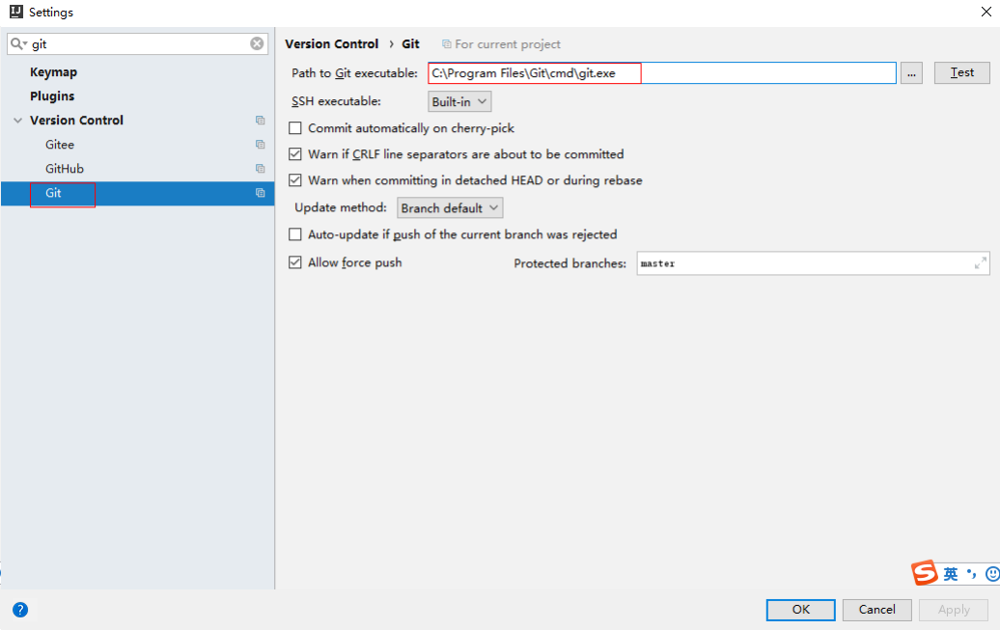

点击Test按钮,现在执行成功，配置完成

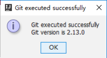

如果找不到可以在cmd输入`where git`

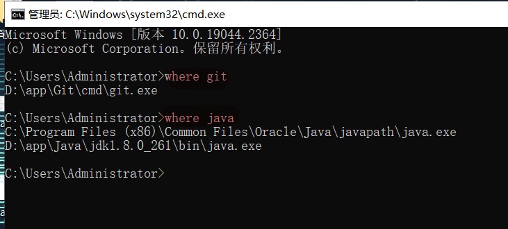

### 5.2、在Idea中操作Git 

场景：本地已经有一个项目，但是并不是git项目，我们需要将这个放到码云的仓库里，和其他开发人员
继续一起协作开发。

#### 5.2.1、创建项目远程仓库（参照4.3）

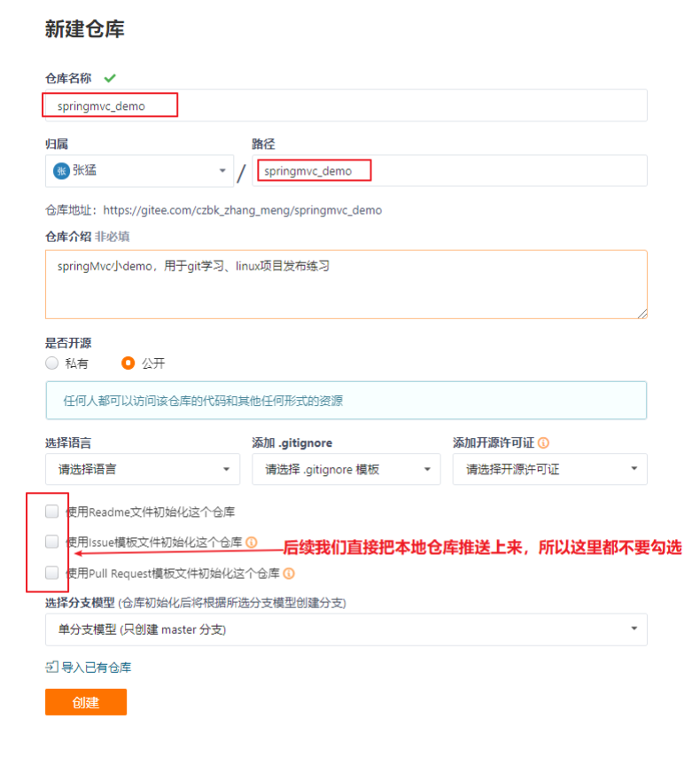

#### 5.2.2、初始化本地仓库 

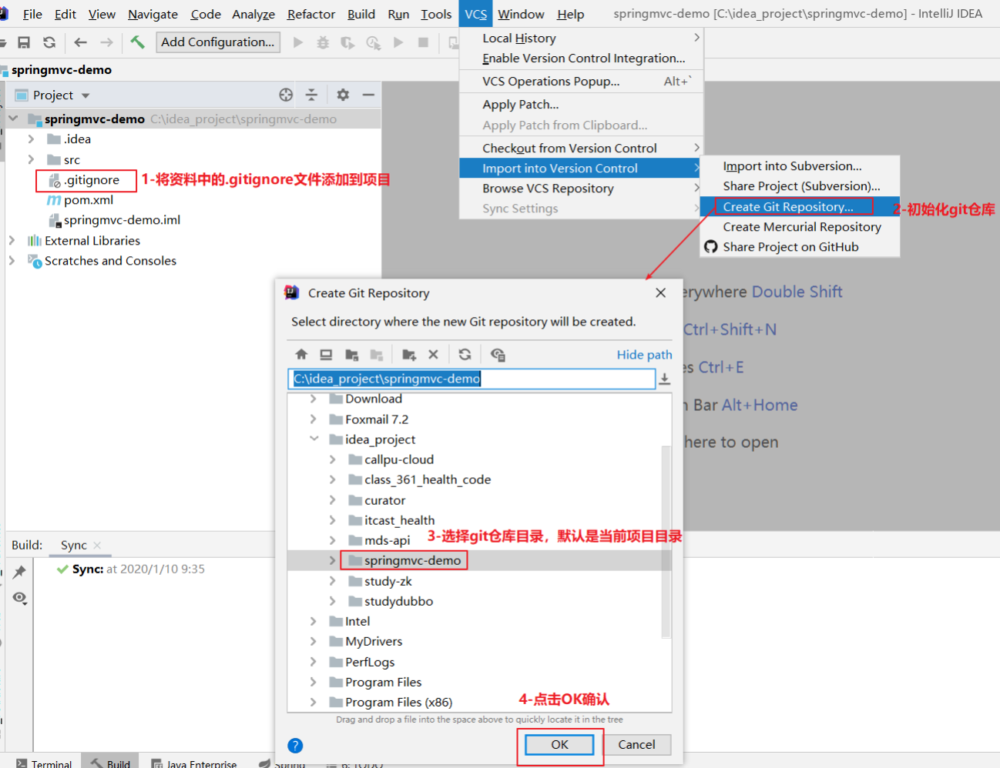


#### 5.2.3、设置远程仓库

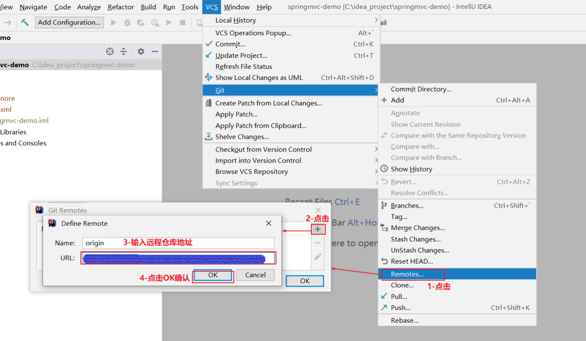


#### 5.2.4、提交到本地仓库

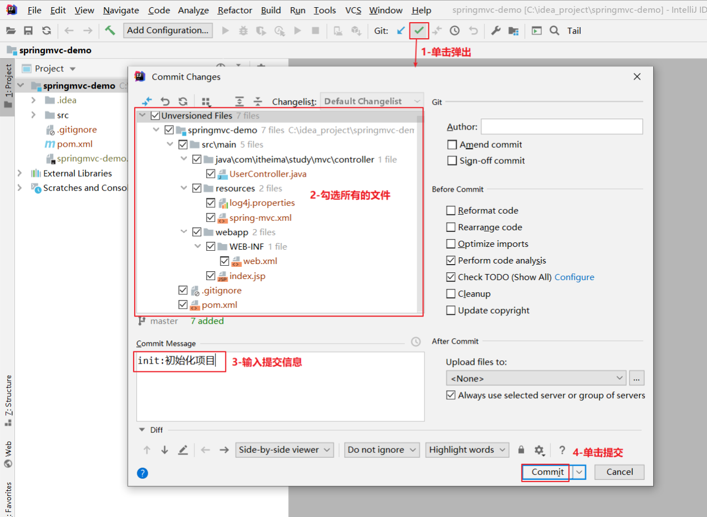


#### 5.2.5、推送到远程仓库

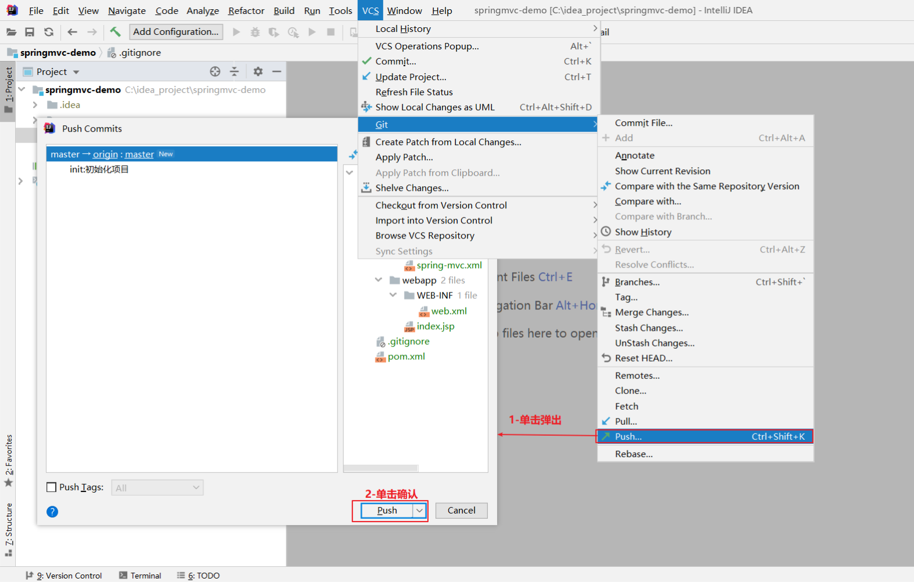


#### 5.2.6、克隆远程仓库到本地

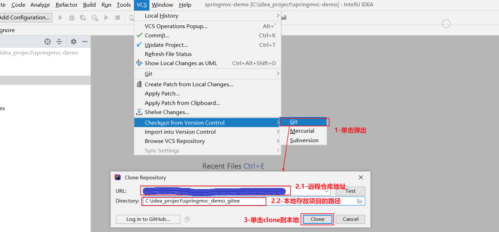

#### 5.2.7、创建分支 

- 最常规的方式

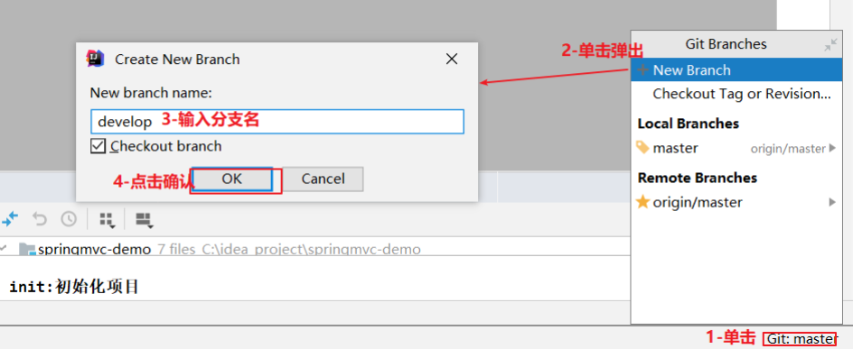

- 最强大的的方式

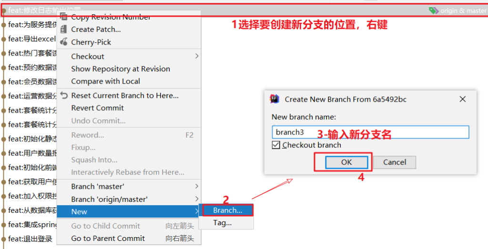

#### 5.2.8、切换分支及其他分支相关操作 

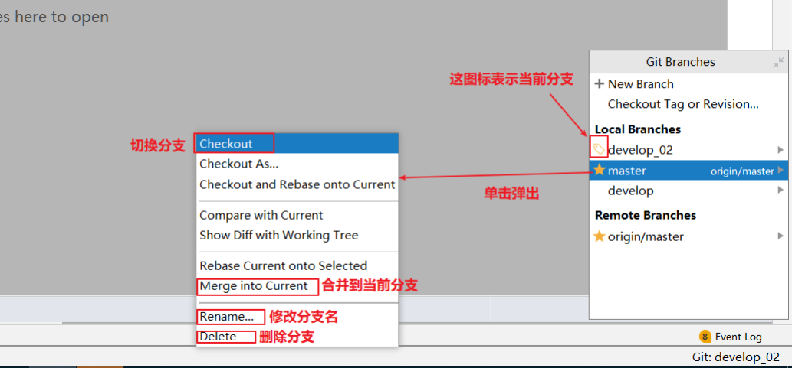


#### 5.2.9、解决冲突

1. 执行merge或pull操作时，可能发生冲突

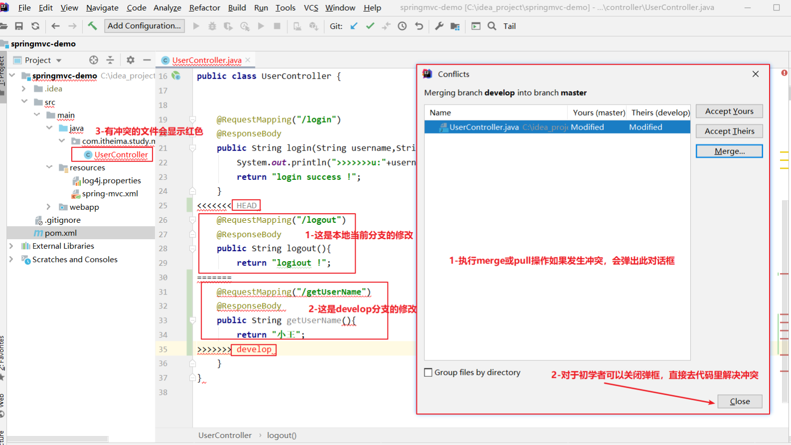

2. 冲突解决后加入暂存区
略
3. 提交到本地仓库
略
4. 推送到远程仓库
略


### 5.3、IDEA常用GIT操作入口 

1. 图上的快捷入口可以基本满足开发的需求。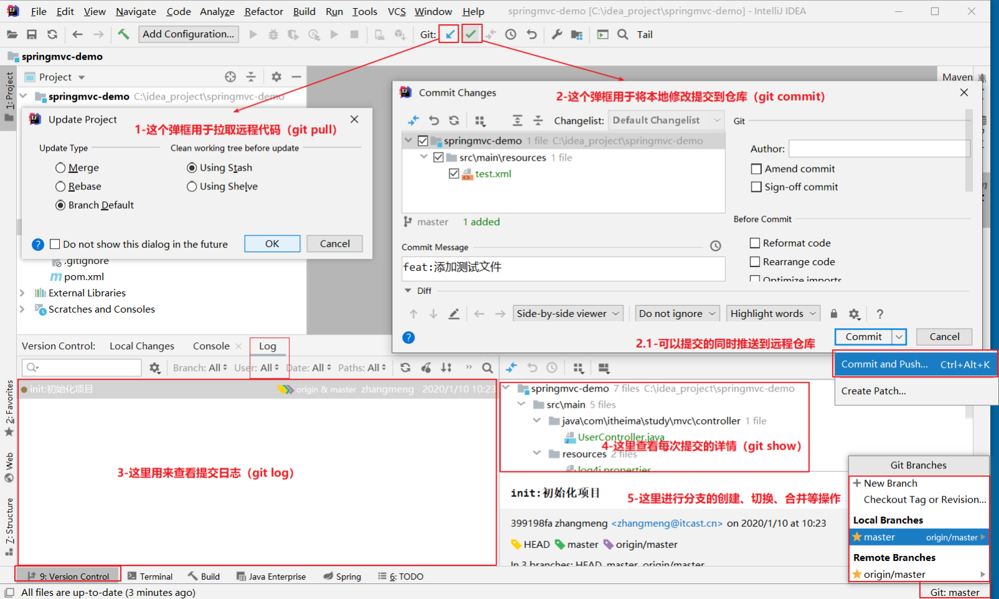


2. 更多在IDEA操作git的入口。

   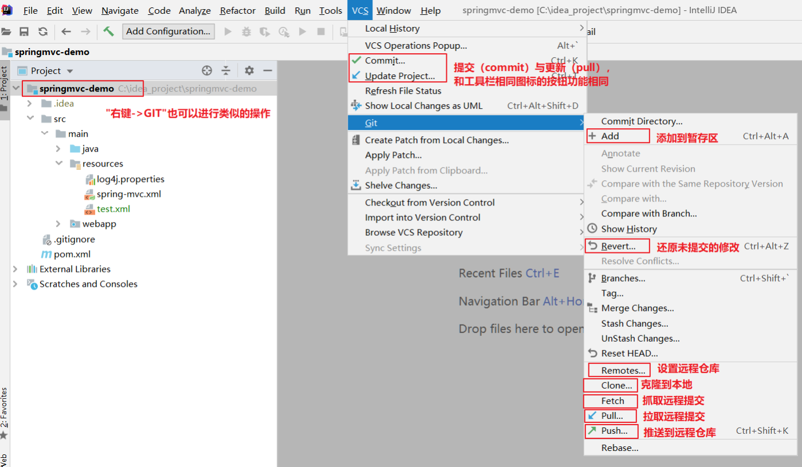


### ~~5.4、场景分析~~ 

基于我们后面的实战模式，我们做一个综合练习
当前的开发环境如下，我们每个人都对这个项目已经开发一段时间，接下来我们要切换成团队开发模式。
也就是我们由一个团队来完成这个项目实战的内容。团队有组长和若干组员组成（组长就是开发中的项目经理）。
所有操作都在idea中完成。
练习场景如下：
1、由组长，基于本项目创建本地仓库；创建远程仓库，推送项目到远程仓库。

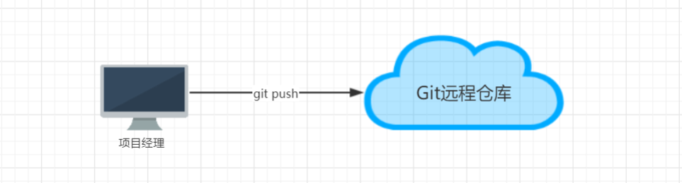

2、每一位组员从远程仓库克隆项目到idea中,这样每位同学在自己电脑上就有了一个工作副本，可以正式的开始开发了。我们模拟两个组员(组员A、组员B)，克隆两个工作区。

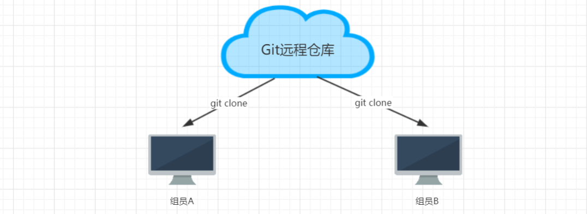

3、组员A修改工作区,提交到本地仓库，再推送到远程仓库。组员B可以直接从远程仓库获取最新的代码。

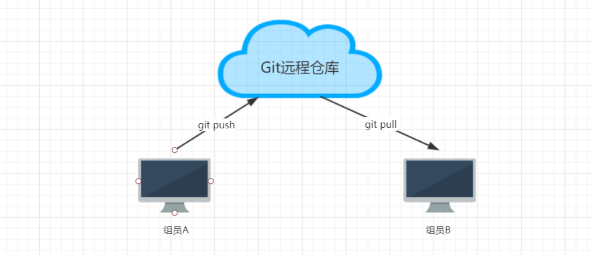

4、组员A和组员B修改了同一个文件的同一行，提交到本地没有问题，但是推送到远程仓库时，后一个
推送操作就会失败。
解决方法：需要先获取远程仓库的代码到本地仓库，编辑冲突，提交并推送代码。

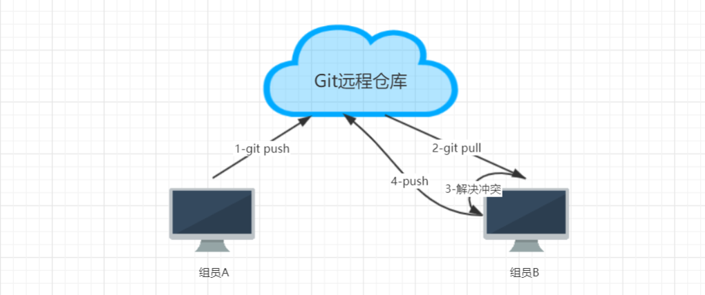


## 今日总结


## 附:几条铁令

1. **切换分支前先提交本地的修改**
2. 代码及时提交，提交过了就不会丢
3. 遇到任何问题都不要删除文件目录，第1时间找老师


## 附:疑难问题解决

1. ### windows下看不到隐藏的文件（`.bashrc`、`.gitignore`） 


2. ### windows下无法创建`.ignore`|`.bashrc`文件

   这里以创建.ignore文件为例：

   - 在git目录下打开`gitbash`

   - 执行指令`touch .gitignore`


## 附：IDEA集成GitBash作为Terminal 


