### 阶段目标

- 能独立针对web项目实施功能测试

---

### 一、测试介绍

-  什么是软件测试？

  ```
  使用技术手段验证软件是否满足需求
  ```

- 测试主流技能

  ```
  1、功能测试
  2、自动化测试
  3、接口测试
  4、性能测试
  
  主流方向建议：
  	1、功能测试+接口测试 
  	2、自动化测试+接口
  	3、功能+性能
  ```

### 二、测试常用分类

- 分类
  - 阶段划分（阶段：软件产出过程顺序）
  - 代码可见度

#### 2.1 阶段划分

- 单元测试
  - 说明：针对程序源代码进行测试（单元：最小独立功能代码段）
  - 提示：
    - 1、国内单元测试一般开发自测
    - 2、单元测试可以解决-快速定位缺陷
    - 3、提高测试执行效率
- 集成测试
  - 说明：针对单元与单元之间的接口进行测试
  - 提示：又称接口测试。
- 系统测试
  - 说明：针对系统整体功能+兼容+文档（说明、安装文档）
- 验收测试
  - 内测：公司内部人员使用，发觉缺陷并修复。
  - 公测：让用户帮忙测试
  - 提示：验收测试,一般要根据项目类型决定是否使用。

#### 2.2 代码可见度划分

> 代码可见度：代码可见的程度上划分

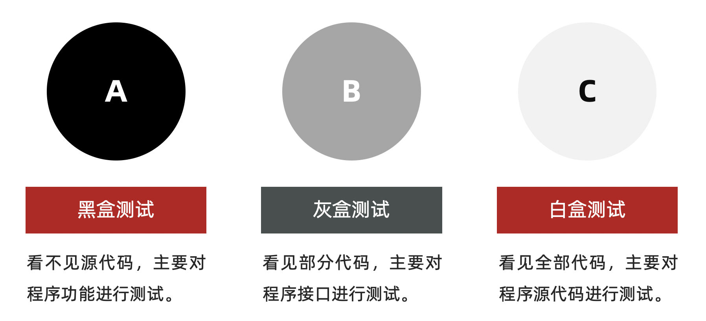

```
黑盒测试：主要针对功能（阶段划分->系统测试）
灰盒测试：针对接口测试（阶段划分->集成测试）
白盒测试：针对程序源代码进行测试（阶段划分->单元测试）
```

#### 2.3 总结

```
系统测试和黑盒测试重点核心是功能测试
集成测试和灰盒测试又称接口测试 
单元测试和白盒测试是对代码进行测试
自动化测试归属功能测试
性能测试、安全测试归属专项测试s
```

### 三、模型

- 角度

  ```
  1、质量模型
  2、测试模型
  ```

#### 3.1 质量模型

> 说明：质量模型能告诉我们，测试时应该考虑的方面


```
重点：功能、性能、兼容、易用性、安全
结论：无论测试硬件或软件，都应该从以上几点来进行分类验证
```

### 四、测试流程

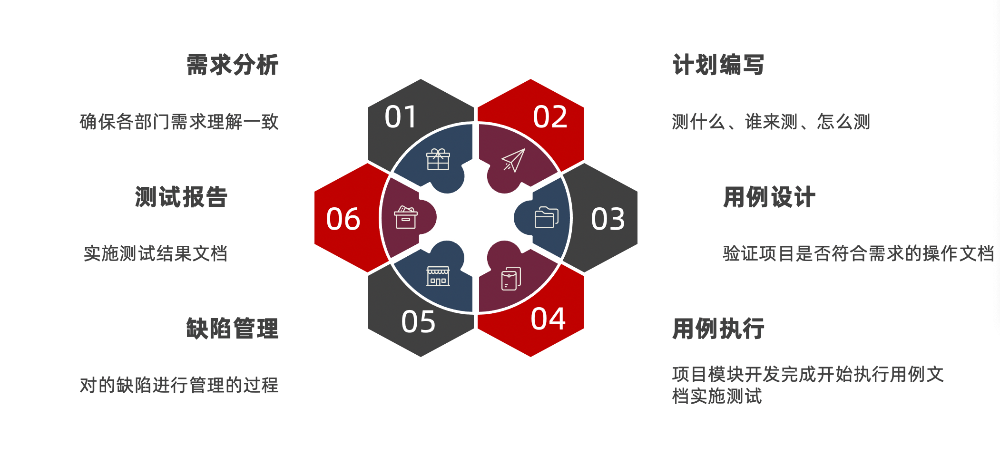

- 需求分析（评审）

  ```
  前提：阅读1遍需求文档，记录不明确之处。
  参与人员：前端、后端、测试、产品
  目的：
  	1、确保各部门需求理解一致
  	2、各角色对需求进行查漏补缺
  	3、了解软件有些功能
  提示：需求分析阶段->软件还未实现（刚立项）
  ```

- 测试计划

  ```
  说明：指导测试执行的文档（重要）
  测什么（目标、范围）
  谁来测（人员进度及安排）
  怎么测（测试工具、测试策略）
  ```

- 用例设计

  ```
  说明：保证能准确验证软件测试点执行的文档。
  1、分析需求
  2、提取测试点
  3、设计用例覆盖测试点
  ```

- 用例执行

  ```
  说明：实施测试
  ```

- 缺陷管理

  ```
  提交->验证->关闭
  ```

- 测试报告

  ```
  1、bug分析及统计
  2、测试中遇到的问题
  3、测试总结（本次测试中的优点和不足）
  ```

### 五、测试用例

- 用例：**用**户使用的案**例**

- 生活中的用例：

  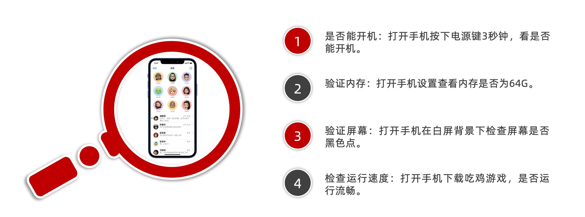

- 用例的作用

  ```
  1、防止漏测
  2、衡量软件是否通过的标准
  ```

- 用例模板

  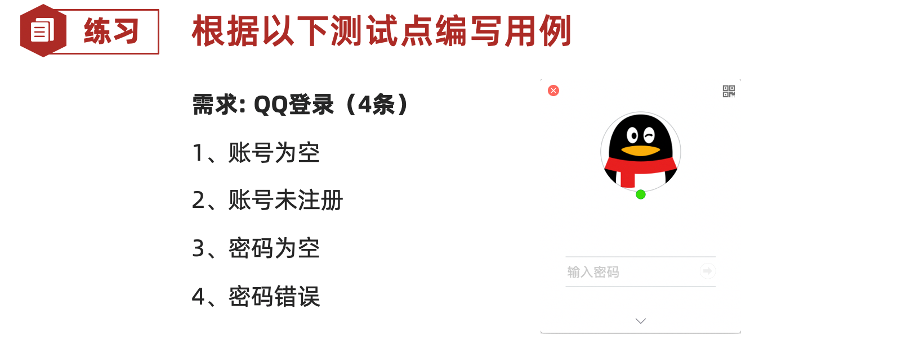

  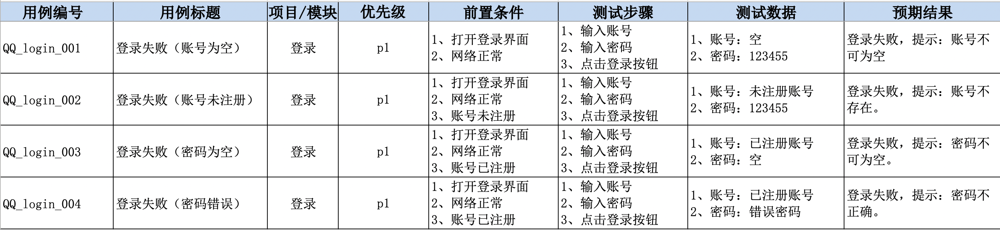

- 八大要素编写规范

  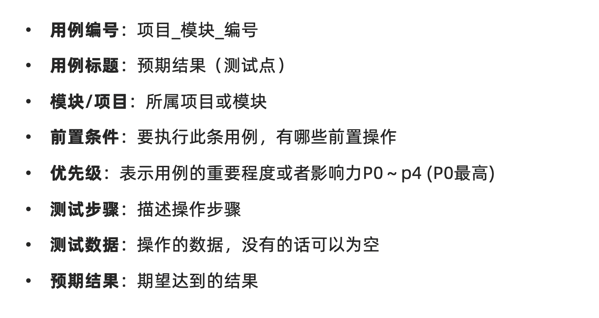

- 练习案例

  ```
  微信发朋友圈
  	1、成功（1张图片） 
  	2、成功（1段文字） 
  	3、失败（内容为空）
  ```

  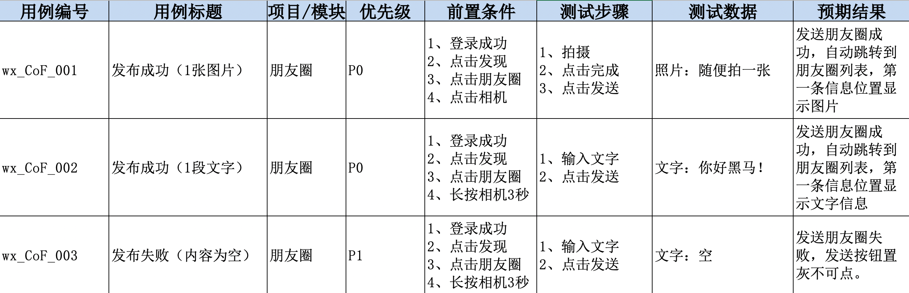
  
- 练习评审

  黄鑫

  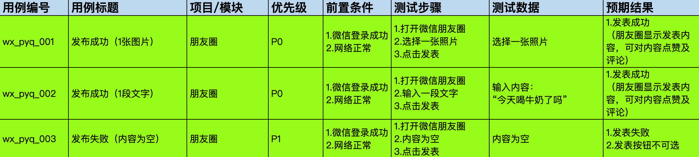

  ```
  秀！🌹
  ```

  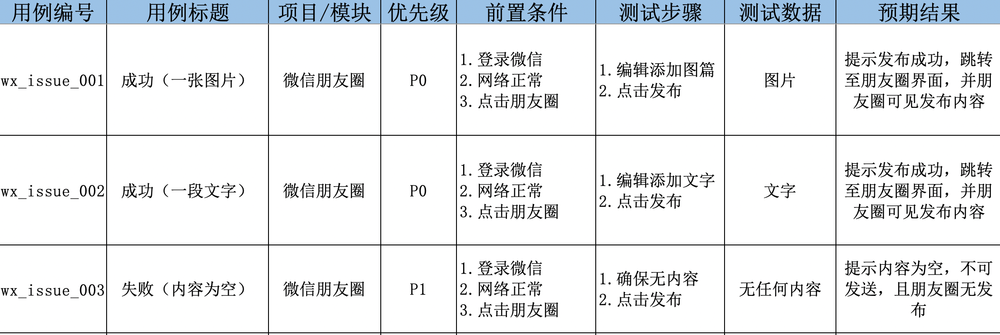

### 六、用例设计方法

- 目标

  ```
  1、能对穷举场景设计测试点
  2、能对限定边界规则设计测试点
  3、能对多条件依赖关系进行设计测试点
  4、能对于项目业务进行设计测试点
  ```

#### 6.1 能对穷举场景设计测试点

> 穷举：无穷无尽

- 方法：等价类划分法

- 介绍：

  

- 案例1（qq程序）

  ```
  要求:6~10位自然数
  ```

  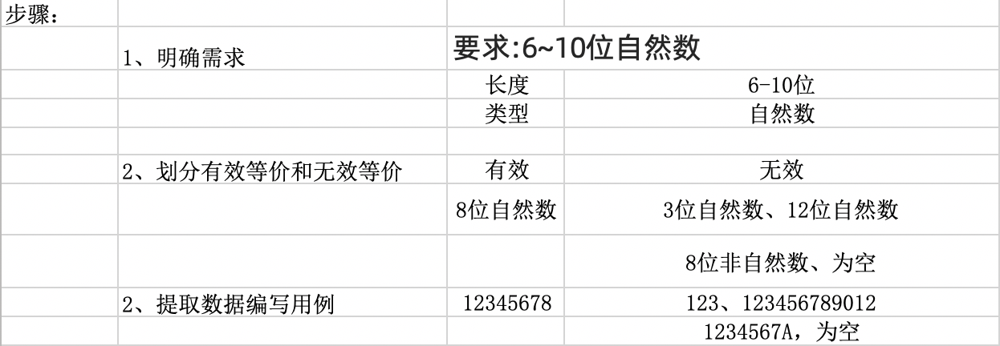

  

- 案例2（电话）

  ```
  要求：
  1. 区号:空或者是三位数字
  2. 前缀码:非“0”且非“1”开头的三位数字
  3. 后缀码:四位数字
  ```

       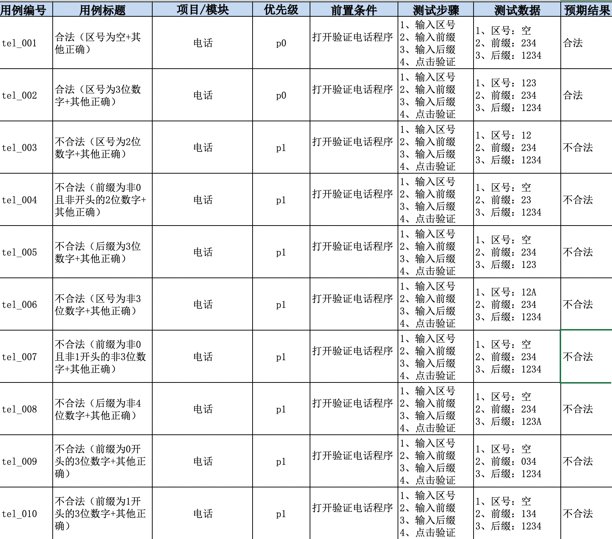

### 七、作业

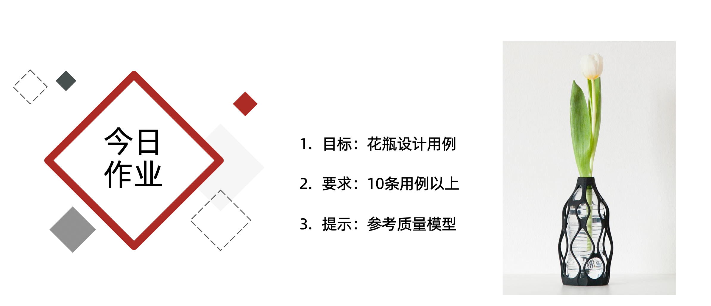