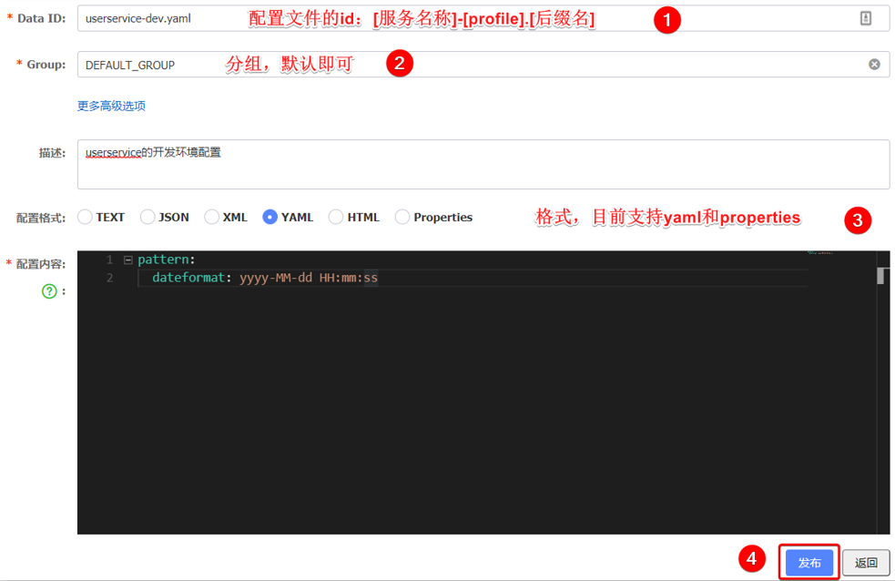
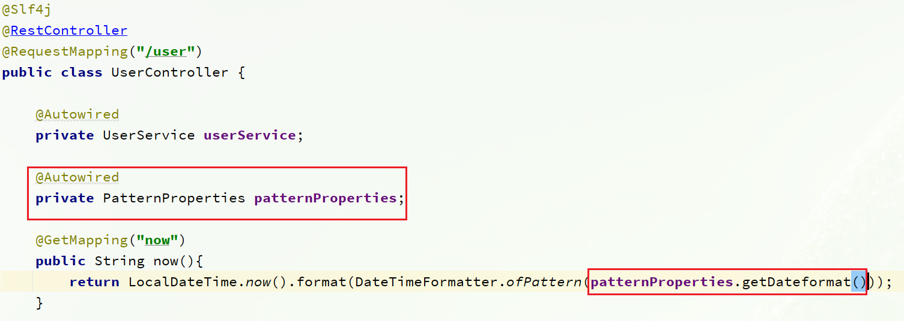
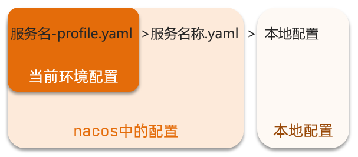

# SpringCloud实用篇02


# 0.学习目标


# 1.Nacos配置管理

Nacos除了可以做注册中心，同样可以做配置管理来使用。


## 1.1.统一配置管理

当微服务部署的实例越来越多，达到数十、数百时，逐个修改微服务配置就会让人抓狂，而且很容易出错。我们需要一种统一配置管理方案，可以集中管理所有实例的配置。


Nacos一方面可以将配置集中管理，另一方可以在配置变更时，及时通知微服务，实现配置的热更新。


### 1.1.1.在nacos中添加配置文件

如何在nacos中管理配置呢？


然后在弹出的表单中，填写配置信息：




> 注意：项目的核心配置，需要热更新的配置才有放到nacos管理的必要。基本不会变更的一些配置还是保存在微服务本地比较好。


### 1.1.2.从微服务拉取配置

微服务要拉取nacos中管理的配置，并且与本地的application.yml配置合并，才能完成项目启动。

但如果尚未读取application.yml，又如何得知nacos地址呢？

因此spring引入了一种新的配置文件：bootstrap.yaml文件，会在application.yml之前被读取，流程如下：


1）引入nacos-config依赖

首先，在user-service服务中，引入nacos-config的客户端依赖：

```xml
<!--nacos配置管理依赖-->
<dependency>
    <groupId>com.alibaba.cloud</groupId>
    <artifactId>spring-cloud-starter-alibaba-nacos-config</artifactId>
</dependency>
```

2）添加bootstrap.yaml

然后，在user-service中添加一个bootstrap.yaml文件，内容如下：

```yaml
spring:
  application:
    name: userservice # 服务名称
  profiles:
    active: dev #开发环境，这里是dev 
  cloud:
    nacos:
      server-addr: localhost:8848 # Nacos地址
      config:
        file-extension: yaml # 文件后缀名
```

这里会根据spring.cloud.nacos.server-addr获取nacos地址，再根据

`${spring.application.name}-${spring.profiles.active}.${spring.cloud.nacos.config.file-extension}`作为文件id，来读取配置。

本例中，就是去读取`userservice-dev.yaml`：


3）读取nacos配置

在user-service中的UserController中添加业务逻辑，读取pattern.dateformat配置：


完整代码：

```java
package cn.itcast.user.web;

import cn.itcast.user.pojo.User;
import cn.itcast.user.service.UserService;
import lombok.extern.slf4j.Slf4j;
import org.springframework.beans.factory.annotation.Autowired;
import org.springframework.beans.factory.annotation.Value;
import org.springframework.web.bind.annotation.*;

import java.time.LocalDateTime;
import java.time.format.DateTimeFormatter;

@Slf4j
@RestController
@RequestMapping("/user")
public class UserController {

    @Autowired
    private UserService userService;

    @Value("${pattern.dateformat}")
    private String dateformat;
    
    @GetMapping("now")
    public String now(){
        return LocalDateTime.now().format(DateTimeFormatter.ofPattern(dateformat));
    }
    // ...略
}
```


在页面访问，可以看到效果：


## 1.2.配置热更新

我们最终的目的，是修改nacos中的配置后，微服务中无需重启即可让配置生效，也就是**配置热更新**。


要实现配置热更新，可以使用两种方式：

### 1.2.1.方式一

在@Value注入的变量所在类上添加注解@RefreshScope：


### 1.2.2.方式二

使用@ConfigurationProperties注解代替@Value注解。

在user-service服务中，添加一个类，读取patterrn.dateformat属性：

```java
package cn.itcast.user.config;

import lombok.Data;
import org.springframework.boot.context.properties.ConfigurationProperties;
import org.springframework.stereotype.Component;

@Component
@Data
@ConfigurationProperties(prefix = "pattern")
public class PatternProperties {
    private String dateformat;
}
```


在UserController中使用这个类代替@Value：




完整代码：

```java
package cn.itcast.user.web;

import cn.itcast.user.config.PatternProperties;
import cn.itcast.user.pojo.User;
import cn.itcast.user.service.UserService;
import lombok.extern.slf4j.Slf4j;
import org.springframework.beans.factory.annotation.Autowired;
import org.springframework.web.bind.annotation.GetMapping;
import org.springframework.web.bind.annotation.PathVariable;
import org.springframework.web.bind.annotation.RequestMapping;
import org.springframework.web.bind.annotation.RestController;

import java.time.LocalDateTime;
import java.time.format.DateTimeFormatter;

@Slf4j
@RestController
@RequestMapping("/user")
public class UserController {

    @Autowired
    private UserService userService;

    @Autowired
    private PatternProperties patternProperties;

    @GetMapping("now")
    public String now(){
        return LocalDateTime.now().format(DateTimeFormatter.ofPattern(patternProperties.getDateformat()));
    }

    // 略
}
```


## 1.3.配置共享

其实微服务启动时，会去nacos读取多个配置文件，例如：

- `[spring.application.name]-[spring.profiles.active].yaml`，例如：userservice-dev.yaml

- `[spring.application.name].yaml`，例如：userservice.yaml

而`[spring.application.name].yaml`不包含环境，因此可以被多个环境共享。


下面我们通过案例来测试配置共享


### 1）添加一个环境共享配置

我们在nacos中添加一个userservice.yaml文件：


### 2）在user-service中读取共享配置

在user-service服务中，修改PatternProperties类，读取新添加的属性：


在user-service服务中，修改UserController，添加一个方法：


### 3）运行两个UserApplication，使用不同的profile

修改UserApplication2这个启动项，改变其profile值：


这样，UserApplication(8081)使用的profile是dev，UserApplication2(8082)使用的profile是test。

启动UserApplication和UserApplication2

访问http://localhost:8081/user/prop，结果：


访问http://localhost:8082/user/prop，结果：


可以看出来，不管是dev，还是test环境，都读取到了envSharedValue这个属性的值。


### 4）配置共享的优先级

当nacos、服务本地同时出现相同属性时，优先级有高低之分：




## 1.4.搭建Nacos集群

Nacos生产环境下一定要部署为集群状态，部署方式参考课前资料中的文档：


# 2.Feign远程调用


先来看我们以前利用RestTemplate发起远程调用的代码：


存在下面的问题：

•代码可读性差，编程体验不统一

•参数复杂URL难以维护


Feign是一个声明式的http客户端，官方地址：https://github.com/OpenFeign/feign

其作用就是帮助我们优雅的实现http请求的发送，解决上面提到的问题。


## 2.1.Feign替代RestTemplate

Fegin的使用步骤如下：

### 1）引入依赖

我们在order-service服务的pom文件中引入feign的依赖：

```xml
<dependency>
    <groupId>org.springframework.cloud</groupId>
    <artifactId>spring-cloud-starter-openfeign</artifactId>
</dependency>
```


### 2）添加注解

在order-service的启动类添加注解开启Feign的功能：


### 3）编写Feign的客户端

在order-service中新建一个接口，内容如下：

```java
package cn.itcast.order.client;

import cn.itcast.order.pojo.User;
import org.springframework.cloud.openfeign.FeignClient;
import org.springframework.web.bind.annotation.GetMapping;
import org.springframework.web.bind.annotation.PathVariable;

@FeignClient("userservice")
public interface UserClient {
    @GetMapping("/user/{id}")
    User findById(@PathVariable("id") Long id);
}
```


这个客户端主要是基于SpringMVC的注解来声明远程调用的信息，比如：

- 服务名称：userservice
- 请求方式：GET
- 请求路径：/user/{id}
- 请求参数：Long id
- 返回值类型：User

这样，Feign就可以帮助我们发送http请求，无需自己使用RestTemplate来发送了。


### 4）测试

修改order-service中的OrderService类中的queryOrderById方法，使用Feign客户端代替RestTemplate：


是不是看起来优雅多了。


### 5）总结

使用Feign的步骤：

① 引入依赖

② 添加@EnableFeignClients注解

③ 编写FeignClient接口

④ 使用FeignClient中定义的方法代替RestTemplate


## 2.2.自定义配置

Feign可以支持很多的自定义配置，如下表所示：

| 类型                   | 作用             | 说明                                                   |
| ---------------------- | ---------------- | ------------------------------------------------------ |
| **feign.Logger.Level** | 修改日志级别     | 包含四种不同的级别：NONE、BASIC、HEADERS、FULL         |
| feign.codec.Decoder    | 响应结果的解析器 | http远程调用的结果做解析，例如解析json字符串为java对象 |
| feign.codec.Encoder    | 请求参数编码     | 将请求参数编码，便于通过http请求发送                   |
| feign. Contract        | 支持的注解格式   | 默认是SpringMVC的注解                                  |
| feign. Retryer         | 失败重试机制     | 请求失败的重试机制，默认是没有，不过会使用Ribbon的重试 |

一般情况下，默认值就能满足我们使用，如果要自定义时，只需要创建自定义的@Bean覆盖默认Bean即可。


下面以日志为例来演示如何自定义配置。

### 2.2.1.配置文件方式

基于配置文件修改feign的日志级别可以针对单个服务：

```yaml
feign:  
  client:
    config: 
      userservice: # 针对某个微服务的配置
        loggerLevel: FULL #  日志级别 
```

也可以针对所有服务：

```yaml
feign:  
  client:
    config: 
      default: # 这里用default就是全局配置，如果是写服务名称，则是针对某个微服务的配置
        loggerLevel: FULL #  日志级别 
```


而日志的级别分为四种：

- NONE：不记录任何日志信息，这是默认值。
- BASIC：仅记录请求的方法，URL以及响应状态码和执行时间
- HEADERS：在BASIC的基础上，额外记录了请求和响应的头信息
- FULL：记录所有请求和响应的明细，包括头信息、请求体、元数据。


### 2.2.2.Java代码方式

也可以基于Java代码来修改日志级别，先声明一个类，然后声明一个Logger.Level的对象：

```java
public class DefaultFeignConfiguration  {
    @Bean
    public Logger.Level feignLogLevel(){
        return Logger.Level.BASIC; // 日志级别为BASIC
    }
}
```


如果要**全局生效**，将其放到启动类的@EnableFeignClients这个注解中：

```java
@EnableFeignClients(defaultConfiguration = DefaultFeignConfiguration .class) 
```


如果是**局部生效**，则把它放到对应的@FeignClient这个注解中：

```java
@FeignClient(value = "userservice", configuration = DefaultFeignConfiguration .class) 
```


## 2.3.Feign使用优化

Feign底层发起http请求，依赖于其它的框架。其底层客户端实现包括：

•URLConnection：默认实现，不支持连接池

•Apache HttpClient ：支持连接池

•OKHttp：支持连接池


因此提高Feign的性能主要手段就是使用**连接池**代替默认的URLConnection。


这里我们用Apache的HttpClient来演示。

1）引入依赖

在order-service的pom文件中引入Apache的HttpClient依赖：

```xml
<!--httpClient的依赖 -->
<dependency>
    <groupId>io.github.openfeign</groupId>
    <artifactId>feign-httpclient</artifactId>
</dependency>
```


2）配置连接池

在order-service的application.yml中添加配置：

```yaml
feign:
  client:
    config:
      default: # default全局的配置
        loggerLevel: BASIC # 日志级别，BASIC就是基本的请求和响应信息
  httpclient:
    enabled: true # 开启feign对HttpClient的支持
    max-connections: 200 # 最大的连接数
    max-connections-per-route: 50 # 每个路径的最大连接数
```


接下来，在FeignClientFactoryBean中的loadBalance方法中打断点：


Debug方式启动order-service服务，可以看到这里的client，底层就是Apache HttpClient：


总结，Feign的优化：

1.日志级别尽量用basic

2.使用HttpClient或OKHttp代替URLConnection

①  引入feign-httpClient依赖

②  配置文件开启httpClient功能，设置连接池参数


## 2.4.最佳实践

所谓最近实践，就是使用过程中总结的经验，最好的一种使用方式。

自习观察可以发现，Feign的客户端与服务提供者的controller代码非常相似：

feign客户端：


UserController：


有没有一种办法简化这种重复的代码编写呢？


### 2.4.1.继承方式

一样的代码可以通过继承来共享：

1）定义一个API接口，利用定义方法，并基于SpringMVC注解做声明。

2）Feign客户端和Controller都集成改接口


优点：

- 简单
- 实现了代码共享

缺点：

- 服务提供方、服务消费方紧耦合

- 参数列表中的注解映射并不会继承，因此Controller中必须再次声明方法、参数列表、注解


### 2.4.2.抽取方式

将Feign的Client抽取为独立模块，并且把接口有关的POJO、默认的Feign配置都放到这个模块中，提供给所有消费者使用。

例如，将UserClient、User、Feign的默认配置都抽取到一个feign-api包中，所有微服务引用该依赖包，即可直接使用。


### 2.4.3.实现基于抽取的最佳实践

#### 1）抽取

首先创建一个module，命名为feign-api：


项目结构：


在feign-api中然后引入feign的starter依赖

```xml
<dependency>
    <groupId>org.springframework.cloud</groupId>
    <artifactId>spring-cloud-starter-openfeign</artifactId>
</dependency>
```


然后，order-service中编写的UserClient、User、DefaultFeignConfiguration都复制到feign-api项目中


#### 2）在order-service中使用feign-api

首先，删除order-service中的UserClient、User、DefaultFeignConfiguration等类或接口。


在order-service的pom文件中中引入feign-api的依赖：

```xml
<dependency>
    <groupId>cn.itcast.demo</groupId>
    <artifactId>feign-api</artifactId>
    <version>1.0</version>
</dependency>
```


修改order-service中的所有与上述三个组件有关的导包部分，改成导入feign-api中的包


#### 3）重启测试

重启后，发现服务报错了：


这是因为UserClient现在在cn.itcast.feign.clients包下，

而order-service的@EnableFeignClients注解是在cn.itcast.order包下，不在同一个包，无法扫描到UserClient。


#### 4）解决扫描包问题

方式一：

指定Feign应该扫描的包：

```java
@EnableFeignClients(basePackages = "cn.itcast.feign.clients")
```


方式二：

指定需要加载的Client接口：

```java
@EnableFeignClients(clients = {UserClient.class})
```


# 3.Gateway服务网关

Spring Cloud Gateway 是 Spring Cloud 的一个全新项目，该项目是基于 Spring 5.0，Spring Boot 2.0 和 Project Reactor 等响应式编程和事件流技术开发的网关，它旨在为微服务架构提供一种简单有效的统一的 API 路由管理方式。


## 3.1.为什么需要网关

Gateway网关是我们服务的守门神，所有微服务的统一入口。

网关的**核心功能特性**：

- 请求路由
- 权限控制
- 限流

架构图：


**权限控制**：网关作为微服务入口，需要校验用户是是否有请求资格，如果没有则进行拦截。

**路由和负载均衡**：一切请求都必须先经过gateway，但网关不处理业务，而是根据某种规则，把请求转发到某个微服务，这个过程叫做路由。当然路由的目标服务有多个时，还需要做负载均衡。

**限流**：当请求流量过高时，在网关中按照下流的微服务能够接受的速度来放行请求，避免服务压力过大。


在SpringCloud中网关的实现包括两种：

- gateway
- zuul

Zuul是基于Servlet的实现，属于阻塞式编程。而SpringCloudGateway则是基于Spring5中提供的WebFlux，属于响应式编程的实现，具备更好的性能。


## 3.2.gateway快速入门

下面，我们就演示下网关的基本路由功能。基本步骤如下：

1. 创建SpringBoot工程gateway，引入网关依赖
2. 编写启动类
3. 编写基础配置和路由规则
4. 启动网关服务进行测试


### 1）创建gateway服务，引入依赖

创建服务：


引入依赖：

```xml
<!--网关-->
<dependency>
    <groupId>org.springframework.cloud</groupId>
    <artifactId>spring-cloud-starter-gateway</artifactId>
</dependency>
<!--nacos服务发现依赖-->
<dependency>
    <groupId>com.alibaba.cloud</groupId>
    <artifactId>spring-cloud-starter-alibaba-nacos-discovery</artifactId>
</dependency>
```


### 2）编写启动类

```java
package cn.itcast.gateway;

import org.springframework.boot.SpringApplication;
import org.springframework.boot.autoconfigure.SpringBootApplication;

@SpringBootApplication
public class GatewayApplication {

	public static void main(String[] args) {
		SpringApplication.run(GatewayApplication.class, args);
	}
}
```


### 3）编写基础配置和路由规则

创建application.yml文件，内容如下：

```yaml
server:
  port: 10010 # 网关端口
spring:
  application:
    name: gateway # 服务名称
  cloud:
    nacos:
      server-addr: localhost:8848 # nacos地址
    gateway:
      routes: # 网关路由配置
        - id: user-service # 路由id，自定义，只要唯一即可
          # uri: http://127.0.0.1:8081 # 路由的目标地址 http就是固定地址
          uri: lb://userservice # 路由的目标地址 lb就是负载均衡，后面跟服务名称
          predicates: # 路由断言，也就是判断请求是否符合路由规则的条件
            - Path=/user/** # 这个是按照路径匹配，只要以/user/开头就符合要求
```


我们将符合`Path` 规则的一切请求，都代理到 `uri`参数指定的地址。

本例中，我们将 `/user/**`开头的请求，代理到`lb://userservice`，lb是负载均衡，根据服务名拉取服务列表，实现负载均衡。


### 4）重启测试

重启网关，访问http://localhost:10010/user/1时，符合`/user/**`规则，请求转发到uri：http://userservice/user/1，得到了结果：


### 5）网关路由的流程图

整个访问的流程如下：


总结：

网关搭建步骤：

1. 创建项目，引入nacos服务发现和gateway依赖

2. 配置application.yml，包括服务基本信息、nacos地址、路由

路由配置包括：

1. 路由id：路由的唯一标示

2. 路由目标（uri）：路由的目标地址，http代表固定地址，lb代表根据服务名负载均衡

3. 路由断言（predicates）：判断路由的规则，

4. 路由过滤器（filters）：对请求或响应做处理


接下来，就重点来学习路由断言和路由过滤器的详细知识


## 3.3.断言工厂

我们在配置文件中写的断言规则只是字符串，这些字符串会被Predicate Factory读取并处理，转变为路由判断的条件

例如Path=/user/**是按照路径匹配，这个规则是由

`org.springframework.cloud.gateway.handler.predicate.PathRoutePredicateFactory`类来

处理的，像这样的断言工厂在SpringCloudGateway还有十几个:

| **名称**   | **说明**                       | **示例**                                                     |
| ---------- | ------------------------------ | ------------------------------------------------------------ |
| After      | 是某个时间点后的请求           | -  After=2037-01-20T17:42:47.789-07:00[America/Denver]       |
| Before     | 是某个时间点之前的请求         | -  Before=2031-04-13T15:14:47.433+08:00[Asia/Shanghai]       |
| Between    | 是某两个时间点之前的请求       | -  Between=2037-01-20T17:42:47.789-07:00[America/Denver],  2037-01-21T17:42:47.789-07:00[America/Denver] |
| Cookie     | 请求必须包含某些cookie         | - Cookie=chocolate, ch.p                                     |
| Header     | 请求必须包含某些header         | - Header=X-Request-Id, \d+                                   |
| Host       | 请求必须是访问某个host（域名） | -  Host=**.somehost.org,**.anotherhost.org                   |
| Method     | 请求方式必须是指定方式         | - Method=GET,POST                                            |
| Path       | 请求路径必须符合指定规则       | - Path=/red/{segment},/blue/**                               |
| Query      | 请求参数必须包含指定参数       | - Query=name, Jack或者-  Query=name                          |
| RemoteAddr | 请求者的ip必须是指定范围       | - RemoteAddr=192.168.1.1/24                                  |
| Weight     | 权重处理                       |                                                              |


我们只需要掌握Path这种路由工程就可以了。


## 3.4.过滤器工厂

GatewayFilter是网关中提供的一种过滤器，可以对进入网关的请求和微服务返回的响应做处理：


### 3.4.1.路由过滤器的种类

Spring提供了31种不同的路由过滤器工厂。例如：

| **名称**             | **说明**                     |
| -------------------- | ---------------------------- |
| AddRequestHeader     | 给当前请求添加一个请求头     |
| RemoveRequestHeader  | 移除请求中的一个请求头       |
| AddResponseHeader    | 给响应结果中添加一个响应头   |
| RemoveResponseHeader | 从响应结果中移除有一个响应头 |
| RequestRateLimiter   | 限制请求的流量               |


### 3.4.2.请求头过滤器

下面我们以AddRequestHeader 为例来讲解。

> **需求**：给所有进入userservice的请求添加一个请求头：Truth=itcast is freaking awesome!


只需要修改gateway服务的application.yml文件，添加路由过滤即可：

```yaml
spring:
  cloud:
    gateway:
      routes:
      - id: user-service 
        uri: lb://userservice 
        predicates: 
        - Path=/user/** 
        filters: # 过滤器
        - AddRequestHeader=Truth, Itcast is freaking awesome! # 添加请求头
```

当前过滤器写在userservice路由下，因此仅仅对访问userservice的请求有效。


### 3.4.3.默认过滤器

如果要对所有的路由都生效，则可以将过滤器工厂写到default下。格式如下：

```yaml
spring:
  cloud:
    gateway:
      routes:
      - id: user-service 
        uri: lb://userservice 
        predicates: 
        - Path=/user/**
      default-filters: # 默认过滤项
      - AddRequestHeader=Truth, Itcast is freaking awesome! 
```


### 3.4.4.总结

过滤器的作用是什么？

① 对路由的请求或响应做加工处理，比如添加请求头

② 配置在路由下的过滤器只对当前路由的请求生效

defaultFilters的作用是什么？

① 对所有路由都生效的过滤器


## 3.5.全局过滤器

上一节学习的过滤器，网关提供了31种，但每一种过滤器的作用都是固定的。如果我们希望拦截请求，做自己的业务逻辑则没办法实现。

### 3.5.1.全局过滤器作用

全局过滤器的作用也是处理一切进入网关的请求和微服务响应，与GatewayFilter的作用一样。区别在于GatewayFilter通过配置定义，处理逻辑是固定的；而GlobalFilter的逻辑需要自己写代码实现。

定义方式是实现GlobalFilter接口。

```java
public interface GlobalFilter {
    /**
     *  处理当前请求，有必要的话通过{@link GatewayFilterChain}将请求交给下一个过滤器处理
     *
     * @param exchange 请求上下文，里面可以获取Request、Response等信息
     * @param chain 用来把请求委托给下一个过滤器 
     * @return {@code Mono<Void>} 返回标示当前过滤器业务结束
     */
    Mono<Void> filter(ServerWebExchange exchange, GatewayFilterChain chain);
}
```


在filter中编写自定义逻辑，可以实现下列功能：

- 登录状态判断
- 权限校验
- 请求限流等


### 3.5.2.自定义全局过滤器

需求：定义全局过滤器，拦截请求，判断请求的参数是否满足下面条件：

- 参数中是否有authorization，

- authorization参数值是否为admin

如果同时满足则放行，否则拦截


实现：

在gateway中定义一个过滤器：

```java
package cn.itcast.gateway.filters;

import org.springframework.cloud.gateway.filter.GatewayFilterChain;
import org.springframework.cloud.gateway.filter.GlobalFilter;
import org.springframework.core.annotation.Order;
import org.springframework.http.HttpStatus;
import org.springframework.stereotype.Component;
import org.springframework.web.server.ServerWebExchange;
import reactor.core.publisher.Mono;

@Order(-1)
@Component
public class AuthorizeFilter implements GlobalFilter {
    @Override
    public Mono<Void> filter(ServerWebExchange exchange, GatewayFilterChain chain) {
        // 1.获取请求参数
        MultiValueMap<String, String> params = exchange.getRequest().getQueryParams();
        // 2.获取authorization参数
        String auth = params.getFirst("authorization");
        // 3.校验
        if ("admin".equals(auth)) {
            // 放行
            return chain.filter(exchange);
        }
        // 4.拦截
        // 4.1.禁止访问，设置状态码
        exchange.getResponse().setStatusCode(HttpStatus.FORBIDDEN);
        // 4.2.结束处理
        return exchange.getResponse().setComplete();
    }
}
```


### 3.5.3.过滤器执行顺序

请求进入网关会碰到三类过滤器：当前路由的过滤器、DefaultFilter、GlobalFilter

请求路由后，会将当前路由过滤器和DefaultFilter、GlobalFilter，合并到一个过滤器链（集合）中，排序后依次执行每个过滤器：


排序的规则是什么呢？

- 每一个过滤器都必须指定一个int类型的order值，**order值越小，优先级越高，执行顺序越靠前**。
- GlobalFilter通过实现Ordered接口，或者添加@Order注解来指定order值，由我们自己指定
- 路由过滤器和defaultFilter的order由Spring指定，默认是按照声明顺序从1递增。
- 当过滤器的order值一样时，会按照 defaultFilter > 路由过滤器 > GlobalFilter的顺序执行。


详细内容，可以查看源码：

`org.springframework.cloud.gateway.route.RouteDefinitionRouteLocator#getFilters()`方法是先加载defaultFilters，然后再加载某个route的filters，然后合并。


`org.springframework.cloud.gateway.handler.FilteringWebHandler#handle()`方法会加载全局过滤器，与前面的过滤器合并后根据order排序，组织过滤器链


## 3.6.跨域问题


### 3.6.1.什么是跨域问题

跨域：域名不一致就是跨域，主要包括：

- 域名不同： www.taobao.com 和 www.taobao.org 和 www.jd.com 和 miaosha.jd.com

- 域名相同，端口不同：localhost:8080和localhost8081

跨域问题：浏览器禁止请求的发起者与服务端发生跨域ajax请求，请求被浏览器拦截的问题


解决方案：CORS，这个以前应该学习过，这里不再赘述了。不知道的小伙伴可以查看https://www.ruanyifeng.com/blog/2016/04/cors.html


### 3.6.2.模拟跨域问题

找到课前资料的页面文件：


放入tomcat或者nginx这样的web服务器中，启动并访问。

可以在浏览器控制台看到下面的错误：


从localhost:8090访问localhost:10010，端口不同，显然是跨域的请求。


### 3.6.3.解决跨域问题

在gateway服务的application.yml文件中，添加下面的配置：

```yaml
spring:
  cloud:
    gateway:
      # 。。。
      globalcors: # 全局的跨域处理
        add-to-simple-url-handler-mapping: true # 解决options请求被拦截问题
        corsConfigurations:
          '[/**]':
            allowedOrigins: # 允许哪些网站的跨域请求 
              - "http://localhost:8090"
            allowedMethods: # 允许的跨域ajax的请求方式
              - "GET"
              - "POST"
              - "DELETE"
              - "PUT"
              - "OPTIONS"
            allowedHeaders: "*" # 允许在请求中携带的头信息
            allowCredentials: true # 是否允许携带cookie
            maxAge: 360000 # 这次跨域检测的有效期
```


