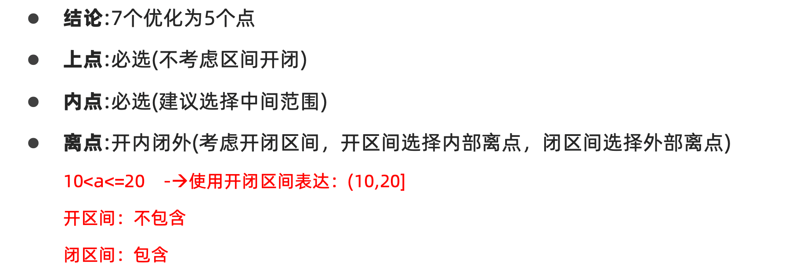
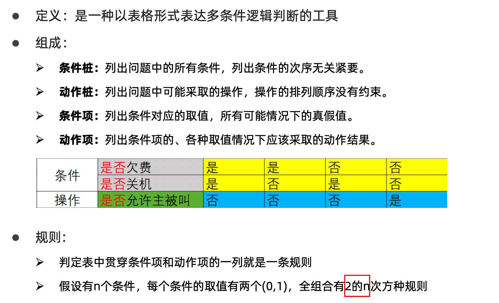
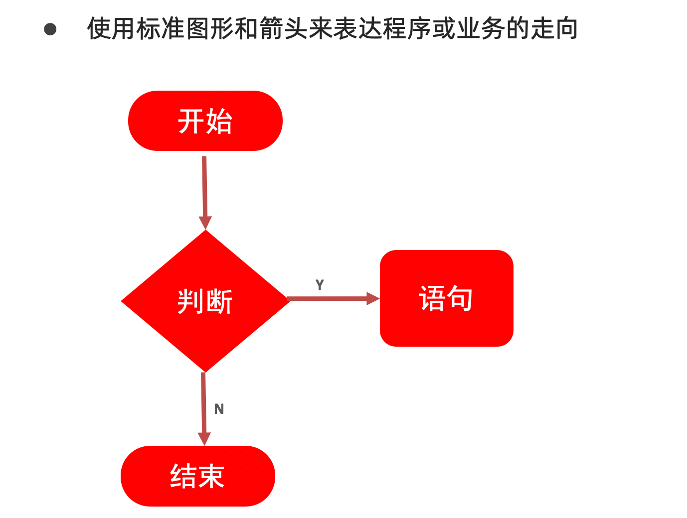
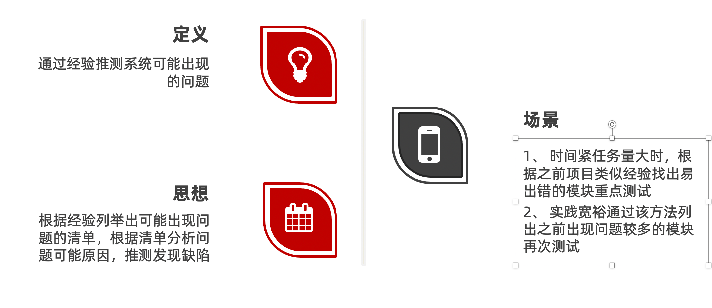
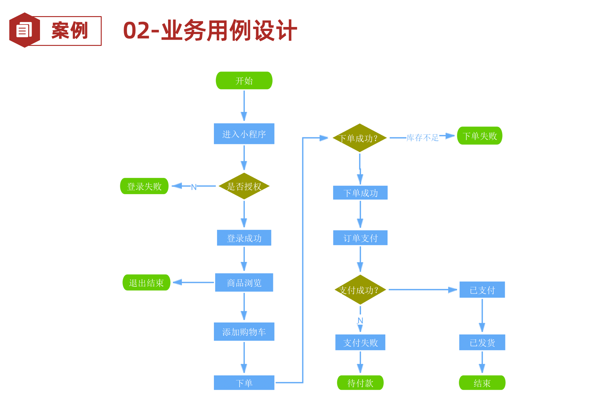

---

### 今天目标

```
能对穷举场景设计测试点
能对限定边界规则设计测试点
能对多条件依赖关系进行设计测试点
能对于项目业务进行设计测试点
```

### 一、解决穷举场景

> 重点：使用等价类划分法

#### 1.1 等价类划分法


```
重点：有效等价和单个无效等价各取1个即可。
步骤：
	1、明确需求
	2、确定有效和无效等价
	3、根据有效和无效造数据编写用例
```


#### 1.2 案例（qq合法验证）

> 需求：验证6~10自然数的qq合法
>
> 自然数：*自然数*由0开始，一个接一个，组成一个无穷的集体


#### 1.3 案例（城市电话验证）


```
重点：
	1、正向用例：一条尽可能覆盖多条
	2、逆向用例：每一条数据，都是一条单独用例。
```

#### 1.4 总结（应用场景）

```
针对：需要有大量数据测试输入，但是没法穷举测试的地方。 
 输入框
 下拉列表
 单选复选框
典型代表：页面的输入框类测试。
```

**友情提示：**完整的用例应该是等价类和边界值一块写。

### 二、解决边界限制问题

> 说明：使用边界值解决边界位数限制问题。2.1 边界值说明


```
提示：
	1、有关范围限制，最多7条用例（暂时未优化）
	2、边界值能解决位数限制问题，但是不能解决类型问题（要结合等价类）
```

#### 2.2 步骤

```
1、明确需求
2、确定有效和无效等价
3、确定边界范围
4、提取数据编写用例
```

#### 2.3 案例1


#### 2.4 案例2


#### 2.5 优化（7点优化5点）

> 重点：开内闭外（开区间选包含的点，闭区选不包含的点）
>
> 开区间：不包含边界上的点（没有等号）。如：a<10
>
> 闭区间：包含边界上的点（有等号）。 如:a<=10

优化策略：



#### 2.6 总结

> 强调：单个输入框，常用的方式 边界+等价类
>
> 面试题：最常用的用例设计方法有哪些？--等价类、边界值

```
在等价类的基础上针对有边界范围的测试数据输入的地方(重点关注边界) 
常见词语描述:大小、尺寸、重量、最大、最小、至多、至少等修饰词语 
典型代表:有边界范围的输入框类测试
```

### 三、解决多条件有依赖关系测试

> 重点：使用判定表

#### 3.1 介绍



#### 3.2 步骤

```
1、明确需求
2、画出判定表
 	1）、列出条件桩和动作桩 
 	2）、填写条件项，对条件进行全组合 
 	3）、根据条件项的组合确定动作项 
 	4）、简化、合并相似规则(有相同的动作)
3、根据规则编写测试用例
```

#### 3.3 案例（订单）

- 需求

  

- 判定表

  

- 用例

  

#### 3.4 练习（文件修改）

- 需求

  

- 判定表

  

- 用例

  

#### 3.5 判定表总结


```
提示：
	1、多条件之间有依赖关系，使用判定表来进行测试覆盖。
	2、判定表一般适合4个以内条件依赖关系
	3、如果条件超过4个，就不适合覆盖所有条件，应采用（正交法）来解决。
```

### 四、业务测试覆盖

>  重点:
>
> ​	1、覆盖业务测试,需要使用流程图法
>
> ​	2、先测试业务，在测试单功能、单模块、单页面

#### 4.1 流程图

>  提示:业务用例是根据流程图来梳理的,需要先了解流程图



```
作用:梳理业务用例
```

练习流程图工具：

```
1、线上工具：https://processon.com/diagraming/605880af07912927bd71c388
2、离线工具：visio
3、其他工具：Excel
```

#### 4.2 案例（ATM）

- 流程图

  

  

- 用例

  

### 五、错误推荐法

> 应用场景：当项目用例都执行完毕，且BUG修复完成，离上线还有一段时间，在这段时间中可是使用错误推荐法复测主要业务或测试未覆盖的功能。



### 六、作业


