# 软考要计算的题

## 计算机系统

### ==内存空间计算==

**要注意的是单位的转换和进制的转换**

### ==码==

### ==流水线==

自己总结：最长时间*条数  + 2个不是最长时间的操作

### ==总线==

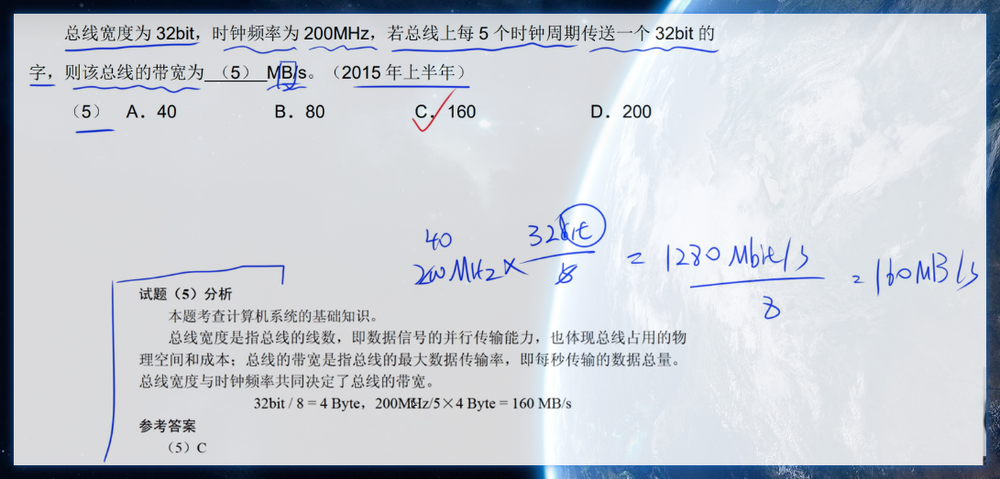

### ==可靠性公式==

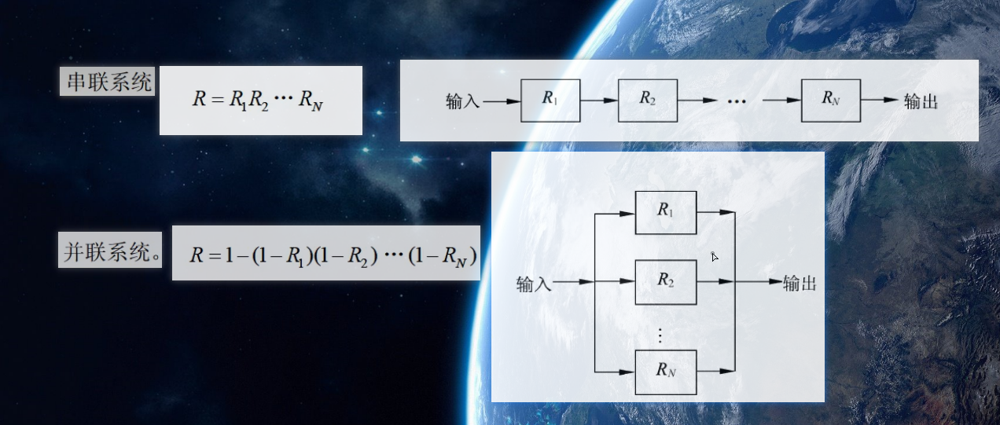

## 操作系统

### ==死锁==

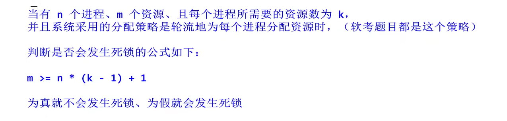

# UML（下午题第三题）

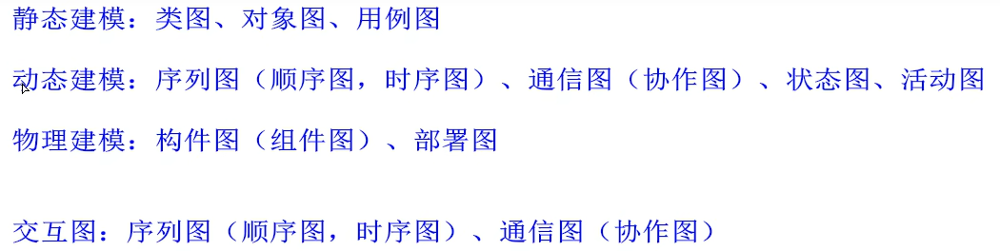

## 依赖

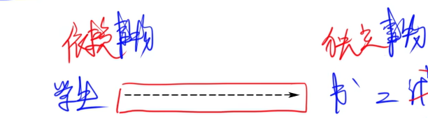

## 关联

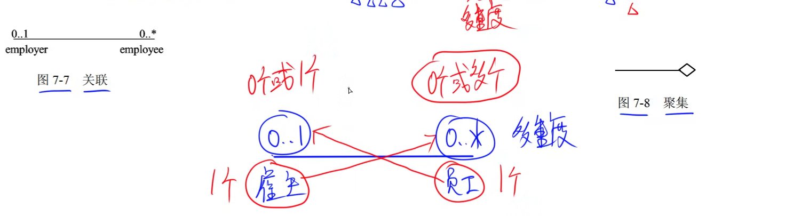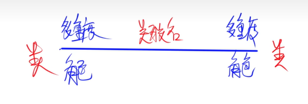

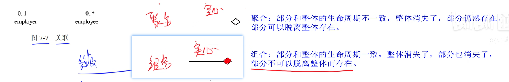

## 泛化

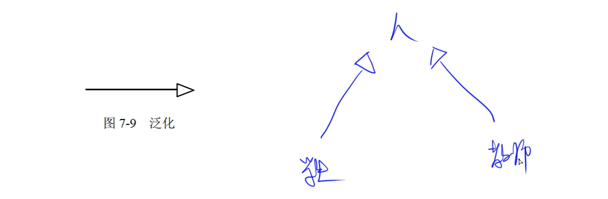

## 实现

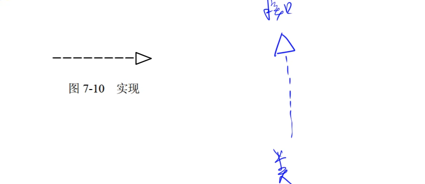

考点比较少

## 用例图的关系

### 包含用例<\<include>>

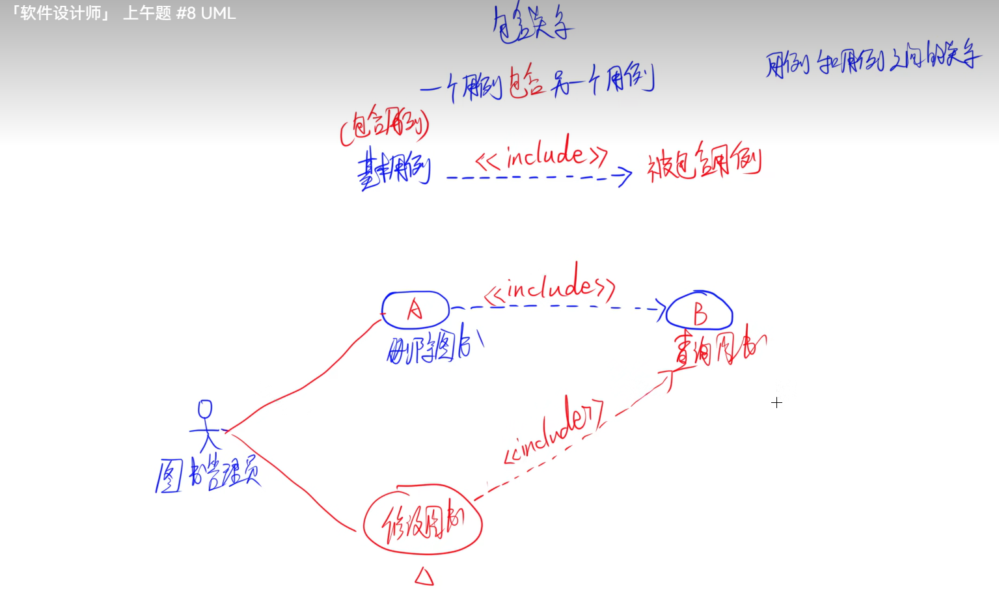

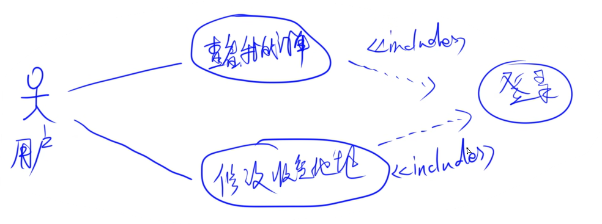

### 扩展关系<\<extend>>

特殊情况

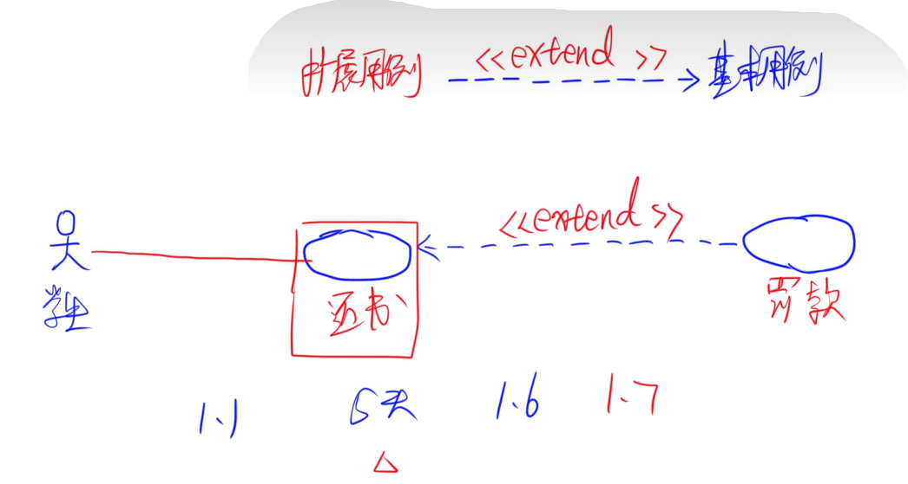

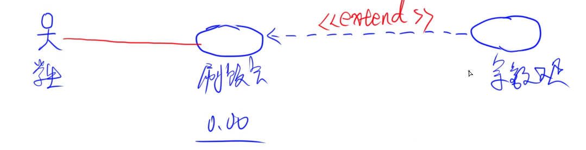

可选情况

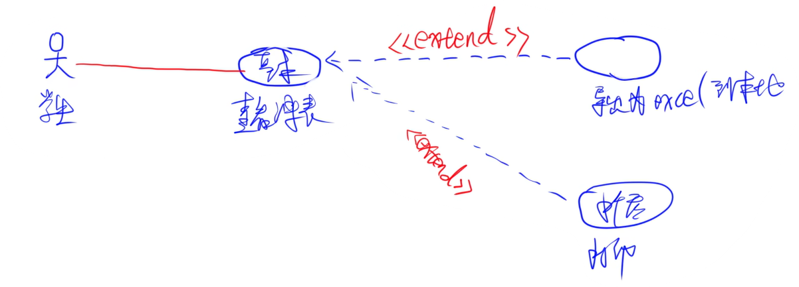

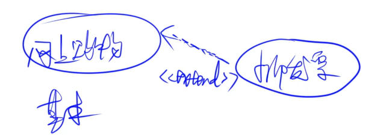

### 泛化

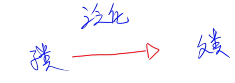

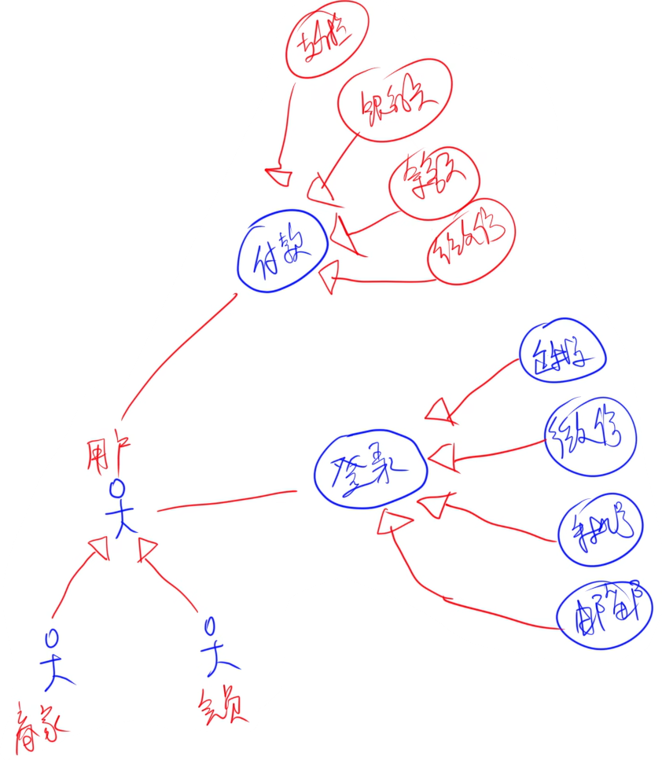

## 序列图（顺序图）

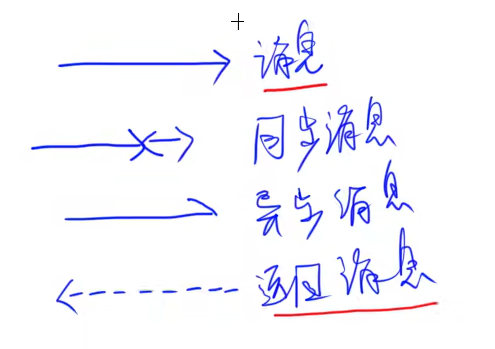

## 通信图

## 设计模式

结构型速记：桥代理组装适配器，享元回家装饰外观

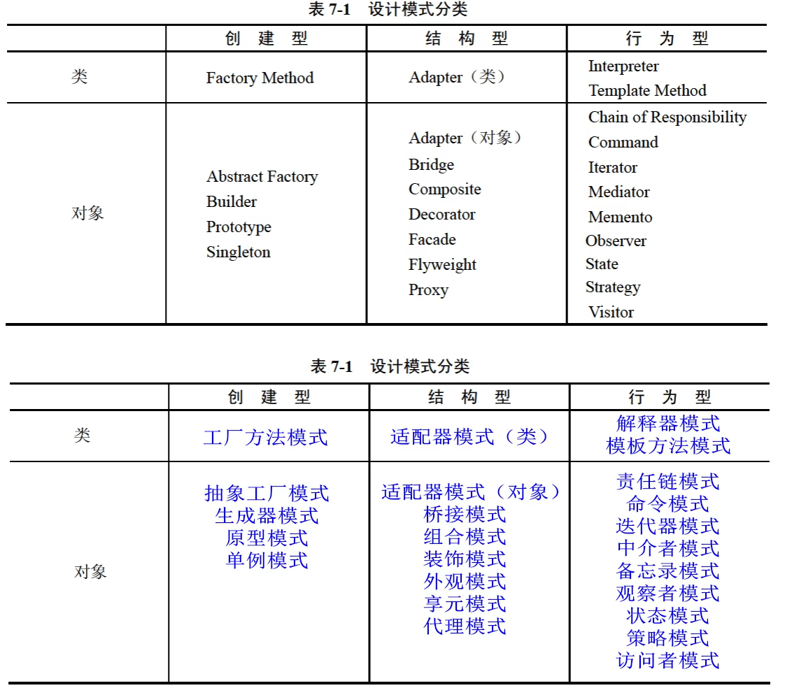

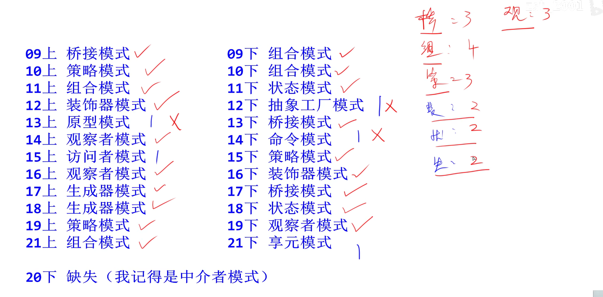

# 下午第一题第4小问

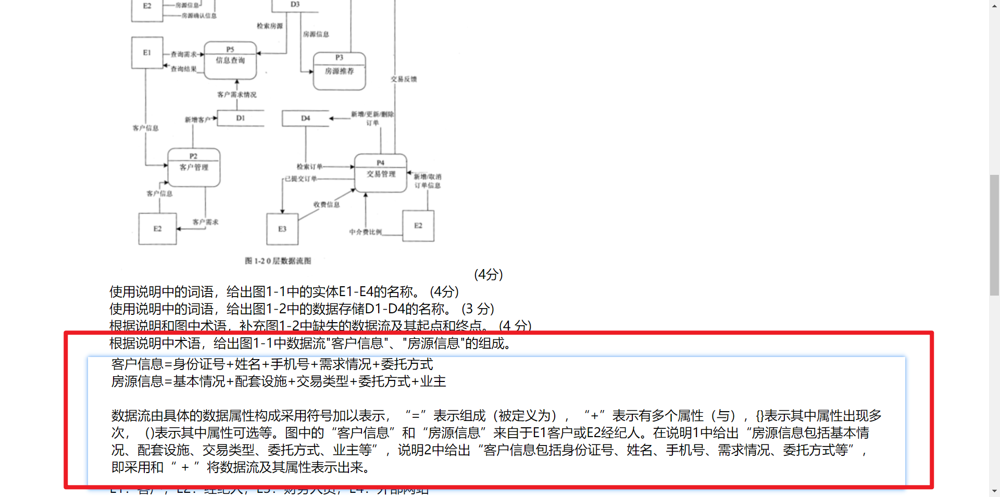

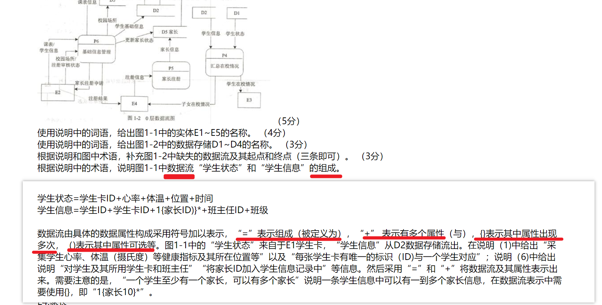

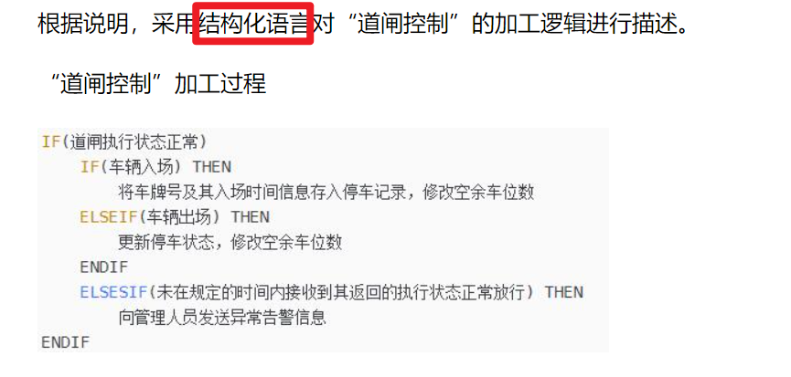

> 本问题要求采用结构化语言描述“缺陷检测”的加工逻辑。常用的加工逻辑描述方法有结构化语言、判定表和判定树3种。
> 结构化语言(如结构化英语)是一种介于自然语言和形式化语言之间的半形式化语言，是自然语言的一个受限子集，没有严格的语法，其结构通常可分为内层和外层。外层有严格
> 的语法，内层的语法比较灵活，可以接近于自然语言的描述。
> (1)外层。用来描述控制结构，采用顺序、选择和重复3种基本结构。
> ①顺序结构。一组祈使语句、选择语句、重复语句的顺序排列。祈使语句是指至少包含一个动词及一个名词，指出要执行的动作及接受动作的对象。
> ②选择结构。一般用IF-THEN-ELSE-ENDIF、CASE-OF-ENDCASE 等关键词。
> ③重复结构。一般用DO-WHILE-ENDDO、REPEAT-UNTIL等关键词。
> (2)内层。一般采用祈使语句的自然语言短语，使用数据字典中的名词和有限的自定义词，其动词含义要具体，尽量不用形容词和副词来修饰，还可使用一些简单的算法运算和逻
> 辑运算符号。
> 缺陷检测相关描述中，根据检测模型和检测质量标准对图像采集接收到的产品待检信息中所有图像进行检测。根据产品是否合格进行不同设置，最后，给检测设备发送检测结果。
> 因此，首先是对所有图像进行检测:然后根据所有图像检测合格与否，设置合格状态与不合格类型:最后，给检测设备发送检测结果。根据是否合格采用选择结构，选择结构可选择
> IF-THEN-ELSE-ENDIF，也可以抽象出CASE情况，使用CASE-OF-ENDCASE。

# 下午第四题算法

==回溯法==     （深度优先）==分支限界法==（广度优先）

==分治算法==：nlog2n或O(nlgn)   

==动态规划法==（最优子结构，重叠子问题）一般时间和空间（O（nm）矩阵连乘（时间n3空间n2））  

==贪心法==（最优子结构，贪心选择性质）时间复杂度要根据题目给的来写，

不要直接写n、n2什么的

# 下午题第6题

interface   abstract  extends    implements     public void  this    static  null  private   protected   super